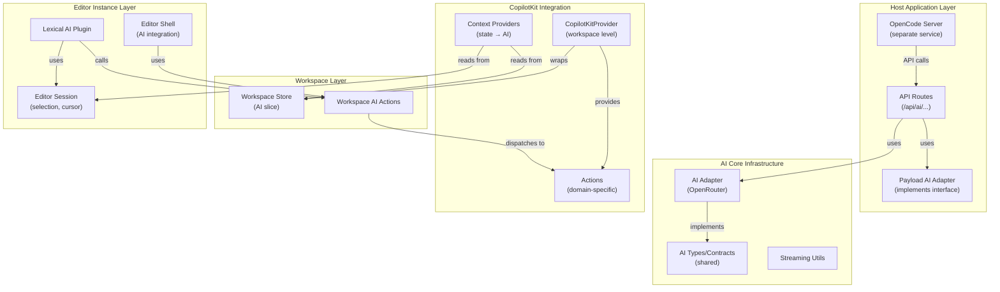
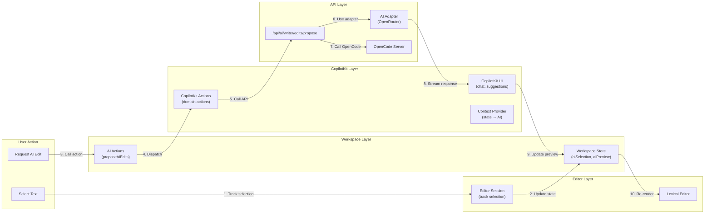

# AI Integration Architecture with CopilotKit

## Overview

This plan establishes a comprehensive AI integration architecture using CopilotKit with OpenRouter, integrating seamlessly with our workspace architecture. The design maintains domain separation while enabling rich AI features across Writer and Forge workspaces.

## Architecture Layers

### AI Integration Layer Diagram



### AI State Flow



## File Structure

```
src/
├── ai/
│   ├── aiadapter/                    # Core AI infrastructure
│   │   ├── types.ts                  # Shared AI types
│   │   ├── openrouter/
│   │   │   ├── openrouter-adapter.ts
│   │   │   └── config.ts
│   │   └── ...
│   ├── adapters/                     # Data adapters (host implements)
│   │   └── types/
│   │       └── ai-data-adapter.ts
│   ├── copilotkit/                   # CopilotKit integration
│   │   ├── providers/
│   │   │   ├── CopilotKitWorkspaceProvider.tsx
│   │   │   └── CopilotKitContextProvider.tsx
│   │   ├── actions/
│   │   │   ├── writer-actions.ts
│   │   │   ├── forge-actions.ts
│   │   │   └── base-actions.ts
│   │   └── hooks/
│   │       ├── useCopilotKitContext.ts
│   │       └── useCopilotKitActions.ts
│   └── components/                   # AI UI components
│       └── AiWorkspace/              # (existing)
│
├── writer/
│   ├── components/WriterWorkspace/
│   │   ├── editor/
│   │   │   ├── LexicalEditor.tsx
│   │   │   ├── lexical/
│   │   │   │   └── plugins/
│   │   │   │       ├── CopilotKitPlugin.tsx    # ← New
│   │   │   │       └── AiSelectionPlugin.tsx   # ← New
│   │   │   └── hooks/
│   │   │       └── useWriterEditorSession.tsx  # ← Use for selection tracking
│   │   └── store/
│   │       └── slices/
│   │           └── ai.slice.ts       # ← Enhanced with CopilotKit
│   └── types/
│       └── writer-ai-types.ts        # Writer-specific AI types
│
├── forge/
│   ├── components/ForgeWorkspace/
│   │   └── store/
│   │       └── slices/
│   │           └── ai.slice.ts       # ← New (for Forge AI)
│   └── types/
│       └── forge-ai-types.ts         # Forge-specific AI types

app/
├── api/
│   └── ai/
│       ├── chat/route.ts
│       ├── writer/
│       │   └── edits/propose/route.ts
│       └── forge/
│           └── ...                   # ← New Forge AI routes
└── lib/
    └── ai/
        ├── ai-adapter.ts
        ├── copilotkit/
        │   ├── server-config.ts      # ← CopilotKit server config
        │   └── opencode-client.ts     # ← OpenCode API client
        └── data-adapter/
            └── payload-ai-adapter.ts
```

## Core Concepts

### 1. AI Core Infrastructure (Shared)

**Location**: `src/ai/aiadapter/`

**Purpose**: Core AI types, adapters, and utilities shared across domains.

**Key Files**:

- `types.ts` - Shared AI contracts (`AiAdapter`, `AiResponse`, `AiStreamResponse`)
- `openrouter/openrouter-adapter.ts` - OpenRouter implementation
- `openrouter/config.ts` - Configuration

**Characteristics**:

- Domain-agnostic
- Used by both Writer and Forge
- Host app implements via adapters

### 2. CopilotKit Integration Layer

**Location**: `src/ai/copilotkit/`

**Purpose**: Integrates CopilotKit with our workspace architecture.

#### CopilotKit Provider Structure

```typescript
// src/ai/copilotkit/providers/CopilotKitWorkspaceProvider.tsx
export function CopilotKitWorkspaceProvider({
  workspaceStore,  // WriterWorkspaceStore or ForgeWorkspaceStore
  children,
}: {
  workspaceStore: StoreApi<WorkspaceState>;
  children: React.ReactNode;
}) {
  const context = useCopilotKitContext(workspaceStore);
  const actions = useCopilotKitActions(workspaceStore);
  
  return (
    <CopilotKit
      runtimeUrl="/api/copilotkit"
      publicApiKey={process.env.NEXT_PUBLIC_COPILOTKIT_API_KEY}
      context={context}
      actions={actions}
    >
      {children}
    </CopilotKit>
  );
}
```

#### Context Provider (State → AI)

```typescript
// src/ai/copilotkit/providers/CopilotKitContextProvider.tsx
export function useCopilotKitContext(
  workspaceStore: StoreApi<WorkspaceState>
): CopilotKitContext[] {
  const state = useStore(workspaceStore);
  
  return useMemo(() => [
    {
      role: 'system',
      content: `You are an AI assistant for the ${state.domain} workspace.
        Current active page: ${state.activePageId}
        Available pages: ${state.pages.map(p => p.title).join(', ')}
        Current selection: ${state.aiSelection ? 'Text selected' : 'No selection'}
      `,
    },
    // Add more context based on workspace state
  ], [state]);
}
```

#### Domain Actions

```typescript
// src/ai/copilotkit/actions/writer-actions.ts
export const writerActions: CopilotAction[] = [
  {
    name: 'proposeTextEdit',
    description: 'Propose edits to selected text in the writer',
    parameters: [
      {
        name: 'instruction',
        type: 'string',
        description: 'What changes to make to the text',
        required: true,
      },
    ],
    handler: async ({ instruction }, { workspaceStore }) => {
      const state = workspaceStore.getState();
      if (!state.aiSelection) {
        throw new Error('No text selected');
      }
      // Call workspace action
      await state.actions.proposeAiEdits(instruction);
    },
  },
  {
    name: 'getCurrentPage',
    description: 'Get information about the current page being edited',
    parameters: [],
    handler: async (_, { workspaceStore }) => {
      const state = workspaceStore.getState();
      const page = state.pages.find(p => p.id === state.activePageId);
      return {
        title: page?.title,
        content: page?.bookBody,
        draftContent: state.drafts[state.activePageId]?.content,
      };
    },
  },
];
```

### 3. Workspace AI Integration

**Pattern**: Each workspace has an AI slice that manages AI state and actions.

#### Writer AI Slice (Enhanced)

```typescript
// src/writer/components/WriterWorkspace/store/slices/ai.slice.ts
export interface AiSlice {
  aiPreview: WriterPatchOp[] | null;
  aiPreviewMeta: WriterAiPreviewMeta | null;
  aiProposalStatus: WriterAiProposalStatus;
  aiError: string | null;
  aiSelection: WriterSelectionSnapshot | null;
  aiSnapshot: WriterDocSnapshot | null;
  aiUndoSnapshot: WriterDocSnapshot | null;
  // New: CopilotKit state
  copilotKitEnabled: boolean;
  aiModel: string;  // Selected model
}

export interface AiActions {
  setAiSelection: (selection: WriterSelectionSnapshot | null) => void;
  proposeAiEdits: (instruction?: string) => Promise<void>;  // ← Enhanced
  applyAiEdits: () => void;
  revertAiDraft: () => void;
  // New: CopilotKit actions
  setCopilotKitEnabled: (enabled: boolean) => void;
  setAiModel: (model: string) => void;
}
```

### 4. Editor Session Store (For Selection Tracking)

**Purpose**: Track editor-specific UI state needed for AI (selection, cursor position).

**Why Needed**:

- Lexical manages its own editor state internally
- We need to track selection for AI operations
- Selection is ephemeral (per-editor-instance)
- Workspace store has AI state, but selection tracking is editor-specific

**Usage**:

```typescript

// In LexicalEditor component

const sessionStore = useWriterEditorSessionStore();

const setSelectedText = (text: string, range: SelectionRange) => {

sessionStore.setState({ selectedText: text, cursorPosition: range });

// Also update workspace store for AI operations

workspaceStore.getState().actions.setAiSelect