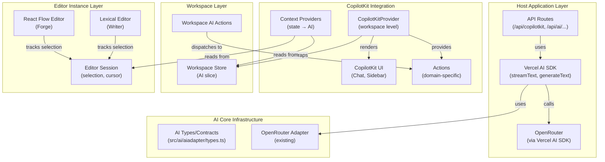
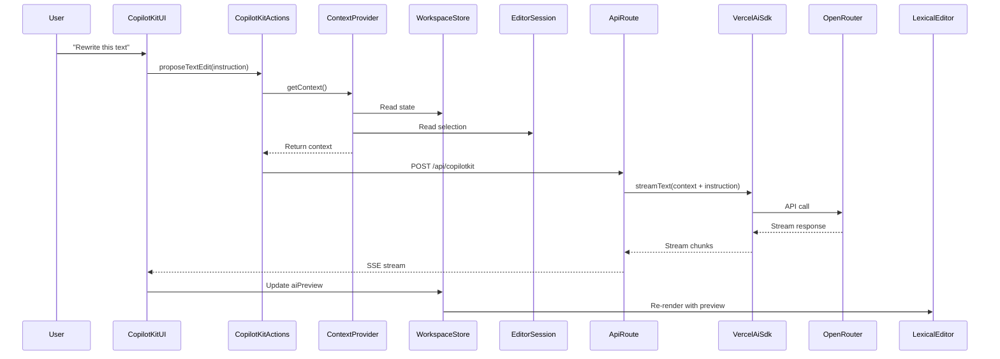

# CopilotKit Integration with Vercel AI SDK

## Overview

This plan integrates CopilotKit (full UI) with Vercel AI SDK and OpenRouter into the Dialogue Forge workspace architecture. The integration maintains domain separation while enabling rich AI features across Writer and Forge workspaces.

## Architecture Layers

### AI Integration Layer Diagram



### AI State Flow



## File Structure

```
src/
├── ai/
│   ├── aiadapter/                    # Core AI infrastructure (existing)
│   │   ├── types.ts
│   │   ├── openrouter/
│   │   └── ...
│   ├── copilotkit/                   # CopilotKit integration
│   │   ├── providers/
│   │   │   ├── CopilotKitWorkspaceProvider.tsx
│   │   │   └── CopilotKitContextProvider.tsx
│   │   ├── actions/
│   │   │   ├── writer-actions.ts
│   │   │   ├── forge-actions.ts
│   │   │   └── base-actions.ts
│   │   └── hooks/
│   │       ├── useCopilotKitContext.ts
│   │       └── useCopilotKitActions.ts
│   └── components/                   # AI UI components
│       └── AiWorkspace/              # (existing)
│
├── writer/
│   ├── components/WriterWorkspace/
│   │   ├── editor/
│   │   │   ├── LexicalEditor.tsx
│   │   │   ├── lexical/
│   │   │   │   └── plugins/
│   │   │   │       ├── CopilotKitPlugin.tsx    # ← New
│   │   │   │       └── AiSelectionPlugin.tsx   # ← New
│   │   │   └── hooks/
│   │   │       └── useWriterEditorSession.tsx  # ← Use for selection
│   │   └── store/
│   │       └── slices/
│   │           └── ai.slice.ts       # ← Enhanced
│   └── types/
│       └── writer-ai-types.ts
│
├── forge/
│   ├── components/ForgeWorkspace/
│   │   └── store/
│   │       └── slices/
│   │           └── ai.slice.ts       # ← New (for Forge AI)
│   └── types/
│       └── forge-ai-types.ts         # ← New

app/
├── api/
│   └── copilotkit/
│       └── route.ts                  # ← CopilotKit runtime
└── lib/
    └── ai/
        ├── ai-adapter.ts             # (existing)
        └── copilotkit/
            └── server-config.ts      # ← CopilotKit server config
```

## Core Concepts

### 1. AI Core Infrastructure (Shared)

**Location**: `src/ai/aiadapter/`

**Purpose**: Core AI types, adapters, and utilities shared across domains.

**Key Files**:

- `types.ts` - Shared AI contracts (`AiAdapter`, `AiResponse`, `AiStreamResponse`)
- `openrouter/openrouter-adapter.ts` - OpenRouter implementation
- `openrouter/config.ts` - Configuration

**Note**: This already exists and works with Vercel AI SDK via OpenRouter.

### 2. CopilotKit Integration Layer

**Location**: `src/ai/copilotkit/`

**Purpose**: Integrates CopilotKit with our workspace architecture.

#### CopilotKit Provider Structure

```typescript
// src/ai/copilotkit/providers/CopilotKitWorkspaceProvider.tsx
import { CopilotKit } from '@copilotkit/react-core';
import { CopilotSidebar } from '@copilotkit/react-ui';
import type { StoreApi } from 'zustand/vanilla';
import type { WriterWorkspaceState } from '@/writer/components/WriterWorkspace/store/writer-workspace-store';
import { useCopilotKitContext } from '../hooks/useCopilotKitContext';
import { useCopilotKitActions } from '../hooks/useCopilotKitActions';

export function CopilotKitWorkspaceProvider({
  workspaceStore,
  children,
}: {
  workspaceStore: StoreApi<WriterWorkspaceState>;
  children: React.ReactNode;
}) {
  const context = useCopilotKitContext(workspaceStore);
  const actions = useCopilotKitActions(workspaceStore);
  
  return (
    <CopilotKit
      runtimeUrl="/api/copilotkit"
      publicApiKey={process.env.NEXT_PUBLIC_COPILOTKIT_API_KEY}
      context={context}
      actions={actions}
    >
      {children}
      <CopilotSidebar
        instructions="You are an AI assistant for the Writer workspace. Help users edit and improve their writing."
        defaultOpen={false}
      />
    </CopilotKit>
  );
}
```

#### Context Provider (State → AI)

```typescript
// src/ai/copilotkit/hooks/useCopilotKitContext.ts
import { useMemo } from 'react';
import { useStore } from 'zustand';
import type { StoreApi } from 'zustand/vanilla';
import type { WriterWorkspaceState } from '@/writer/components/WriterWorkspace/store/writer-workspace-store';

export function useCopilotKitContext(
  workspaceStore: StoreApi<WriterWorkspaceState>
): CopilotRuntimeContext[] {
  const state = useStore(workspaceStore);
  
  return useMemo(() => [
    {
      role: 'system',
      content: `You are an AI assistant for the Writer workspace.

Current Context:
- Active Page: ${state.activePageId ? state.pages.find(p => p.id === state.activePageId)?.title : 'None'}
- Total Pages: ${state.pages.length}
- Selected Text: ${state.aiSelection ? 'Yes' : 'No'}
${state.aiSelection ? `- Selection Range: ${state.aiSelection.start}-${state.aiSelection.end}` : ''}
- Draft Status: ${state.drafts[state.activePageId ?? -1]?.status ?? 'N/A'}

Available Actions:
- proposeTextEdit: Propose edits to selected text
- getCurrentPage: Get information about current page
- listPages: List all available pages
      `,
    },
  ], [state]);
}
```

#### Domain Actions

```typescript
// src/ai/copilotkit/actions/writer-actions.ts
import type { CopilotAction } from '@copilotkit/react-core';
import type { StoreApi } from 'zustand/vanilla';
import type { WriterWorkspaceState } from '@/writer/components/WriterWorkspace/store/writer-workspace-store';

export function createWriterActions(
  workspaceStore: StoreApi<WriterWorkspaceState>
): CopilotAction[] {
  return [
    {
      name: 'proposeTextEdit',
      description: 'Propose edits to selected text in the writer. The AI will suggest improvements or changes based on the instruction.',
      parameters: [
        {
          name: 'instruction',
          type: 'string',
          description: 'What changes to make to the text (e.g., "make it more concise", "improve clarity", "fix grammar")',
          required: true,
        },
      ],
      handler: async ({ instruction }) => {
        const state = workspaceStore.getState();
        if (!state.aiSelection) {
          throw new Error('No text selected. Please select text first.');
        }
        await state.actions.proposeAiEdits(instruction);
        return { success: true, message: 'Edit proposal generated. Check the preview panel.' };
      },
    },
    {
      name: 'getCurrentPage',
      description: 'Get information about the current page being edited',
      parameters: [],
      handler: async () => {
        const state = workspaceStore.getState();
        const page = state.pages.find(p => p.id === state.activePageId);
        if (!page) {
          return { error: 'No page selected' };
        }
        const draft = state.drafts[page.id];
        return {
          title: page.title,
          content: draft?.content ?? page.bookBody ?? '',
          hasUnsavedChanges: draft?.status === 'dirty',
        };
      },
    },
    {
      name: 'listPages',
      description: 'List all available pages in the current project',
      parameters: [],
      handler: async () => {
        const state = workspaceStore.getState();
        return {
          pages: state.pages.map(p => ({
            id: p.id,
            title: p.title,
            isActive: p.id === state.activePageId,
          })),
        };
      },
    },
  ];
}
```

### 3. Workspace AI Integration

**Pattern**: Each workspace has an AI slice that manages AI state and actions.

#### Writer AI Slice (Enhanced)

```typescript
// src/writer/components/WriterWorkspace/store/slices/ai.slice.ts
export interface AiSlice {
  aiPreview: WriterPatchOp[] | null;
  aiPreviewMeta: WriterAiPreviewMeta | null;
  aiProposalStatus: WriterAiProposalStatus;
  aiError: string | null;
  aiSelection: WriterSelectionSnapshot | null;
  aiSnapshot: WriterDocSnapshot | null;
  aiUndoSnapshot: WriterDocSnapshot | null;
  // New: CopilotKit state
  copilotKitEnabled: boolean;
  aiModel: string;  // Selected model
}

export interface AiActions {
  setAiSelection: (selection: WriterSelectionSnapshot | null) => void;
  proposeAiEdits: (instruction?: string) => Promise<void>;  // ← Enhanced with instruction
  applyAiEdits: () => void;
  revertAiDraft: () => void;
  // New: CopilotKit actions
  setCopilotKitEnabled: (enabled: boolean) => void;
  setAiModel: (model: string) => void;
}
```

### 4. Editor Session Store (For Selection Tracking)

**Purpose**: Track editor-specific UI state needed for AI (selection, cursor position).

**Why Needed**:

- Lexical manages its own editor state internally
- We need to track selection for AI operations
- Selection is ephemeral (per-editor-instance)
- Workspace store has AI state, but selection tracking is editor-specific

**Usage**:

```typescript
// In LexicalEditor component with AiSelectionPlugin
const sessionStore = useWriterEditorSessionStore();

// Plugin tracks selection and updates both session store and workspace store
const setSelectedText = (text: string, range: SelectionRange) => {
  sessionStore.setState({ selectedText: text, cursorPosition: range });
  
  // Also update workspace store for AI operations
  workspaceStore.getState().actions.setAiSelection({
    start: range.start,
    end: range.end,
    text,
  });
};
```

### 5. Lexical AI Integration

**Location**: `src/writer/components/WriterWorkspace/editor/lexical/plugins/`

#### AiSelectionPlugin

```typescript
// src/writer/components/WriterWorkspace/editor/lexical/plugins/AiSelectionPlugin.tsx
import { useEffect } from 'react';
import { useLexicalComposerContext } from '@lexical/react/LexicalComposerContext';
import { $getSelection, $isRangeSelection } from 'lexical';
import { useWriterWorkspaceStore } from '@/writer/components/WriterWorkspace/store/writer-workspace-store';
import { useWriterEditorSessionStore } from '../hooks/useWriterEditorSession';

export function AiSelectionPlugin() {
  const [editor] = useLexicalComposerContext();
  const setAiSelection = useWriterWorkspaceStore((state) => state.actions.setAiSelection);
  const sessionStore = useWriterEditorSessionStore();

  useEffect(() => {
    return editor.registerUpdateListener(({ editorState }) => {
      editorState.read(() => {
        const selection = $getSelection();
        if (!$isRangeSelection(selection)) {
          setAiSelection(null);
          sessionStore.setState({ selectedText: null, cursorPosition: null });
          return;
        }

        const selectedText = selection.getTextContent();
        const root = editorState._nodeMap.get('root');
        const fullText = root?.getTextContent() ?? '';
        
        if (!selectedText) {
          setAiSelection(null);
          sessionStore.setState({ selectedText: null, cursorPosition: null });
          return;
        }

        // Calculate start/end positions
        const start = fullText.indexOf(selectedText);
        if (start === -1) {
          setAiSelection(null);
          return;
        }

        const selectionSnapshot = {
          start,
          end: start + selectedText.length,
          text: selectedText,
        };

        setAiSelection(selectionSnapshot);
        sessionStore.setState({
          selectedText,
          cursorPosition: { line: 0, column: start }, // Simplified
        });
      });
    });
  }, [editor, setAiSelection, sessionStore]);

  return null;
}
```

#### CopilotKitPlugin

```typescript
// src/writer/components/WriterWorkspace/editor/lexical/plugins/CopilotKitPlugin.tsx
import { useEffect } from 'react';
import { useLexicalComposerContext } from '@lexical/react/LexicalComposerContext';
import { useCopilotReadable } from '@copilotkit/react-core';
import { $getRoot } from 'lexical';

export function CopilotKitPlugin() {
  const [editor] = useLexicalComposerContext();

  // Make editor content readable to CopilotKit
  const editorContent = useCopilotReadable({
    description: 'Current editor content',
    value: () => {
      return editor.getEditorState().read(() => {
        return $getRoot().getTextContent();
      });
    },
  });

  return null;
}
```

### 6. API Route (CopilotKit Runtime)

**Location**: `app/api/copilotkit/route.ts`

```typescript
// app/api/copilotkit/route.ts
import { CopilotRuntime, OpenAILikeClient } from '@copilotkit/runtime';
import { openai } from '@ai-sdk/openai';
import { streamText } from 'ai';
import { getOpenRouterConfig } from '@/ai/aiadapter/openrouter/config';

const runtime = new CopilotRuntime();

export async function POST(req: Request) {
  const config = getOpenRouterConfig();
  
  // Create OpenAI-compatible client for OpenRouter
  const client = new OpenAILikeClient({
    baseURL: config.baseUrl,
    apiKey: config.apiKey,
  });

  return runtime.response(req, {
    model: openai('gpt-4o', {
      baseURL: config.baseUrl,
      apiKey: config.apiKey,
    }),
    // Actions and context are provided by CopilotKit client-side
  });
}
```

## Integration Points

### Writer Workspace Integration

1. **Wrap WriterWorkspace with CopilotKitProvider**:
```typescript
// src/writer/components/WriterWorkspace/WriterWorkspace.tsx
export function WriterWorkspace({ ... }: WriterWorkspaceProps) {
  const storeRef = useRef(createWriterWorkspaceStore(...));
  
  return (
    <WriterWorkspaceStoreProvider store={storeRef.current}>
      <CopilotKitWorkspaceProvider workspaceStore={storeRef.current}>
        <WriterWorkspaceContent ... />
      </CopilotKitWorkspaceProvider>
    </WriterWorkspaceStoreProvider>
  );
}
```

2. **Add AI plugins to LexicalEditor**:
```typescript
// src/writer/components/WriterWorkspace/editor/LexicalEditor.tsx
<LexicalComposer initialConfig={initialConfig}>
  <ToolbarPlugin />
  <AiSelectionPlugin />  {/* ← New */}
  <CopilotKitPlugin />  {/* ← New */}
  <RichTextPlugin ... />
  ...
</LexicalComposer>
```

3. **Use Editor Session for Selection**:

- `useWriterEditorSession` tracks selection state
- Updates both session store (UI state) and workspace store (AI state)

### Forge Workspace Integration (Future)

1. **Create Forge AI Slice**:
```typescript
// src/forge/components/ForgeWorkspace/store/slices/ai.slice.ts
export interface ForgeAiSlice {
  aiSuggestions: ForgeNodeSuggestion[] | null;
  aiProposalStatus: 'idle' | 'loading' | 'ready' | 'error';
  aiError: string | null;
}

export interface ForgeAiActions {
  proposeNodeContent: (nodeId: string, instruction: string) => Promise<void>;
  proposeGraphLayout: () => Promise<void>;
  generateCharacterDialogue: (characterId: string, context: string) => Promise<void>;
}
```

2. **Create Forge Actions**:
```typescript
// src/ai/copilotkit/actions/forge-actions.ts
export function createForgeActions(
  workspaceStore: StoreApi<ForgeWorkspaceState>
): CopilotAction[] {
  return [
    {
      name: 'proposeNodeContent',
      description: 'Propose content for a dialogue node',
      parameters: [
        { name: 'nodeId', type: 'string', required: true },
        { name: 'instruction', type: 'string', required: true },
      ],
      handler: async ({ nodeId, instruction }) => {
        await workspaceStore.getState().actions.proposeNodeContent(nodeId, instruction);
      },
    },
    // ... more actions
  ];
}
```


## Context Provider Pattern

### How Context Flows to AI

```typescript

// s