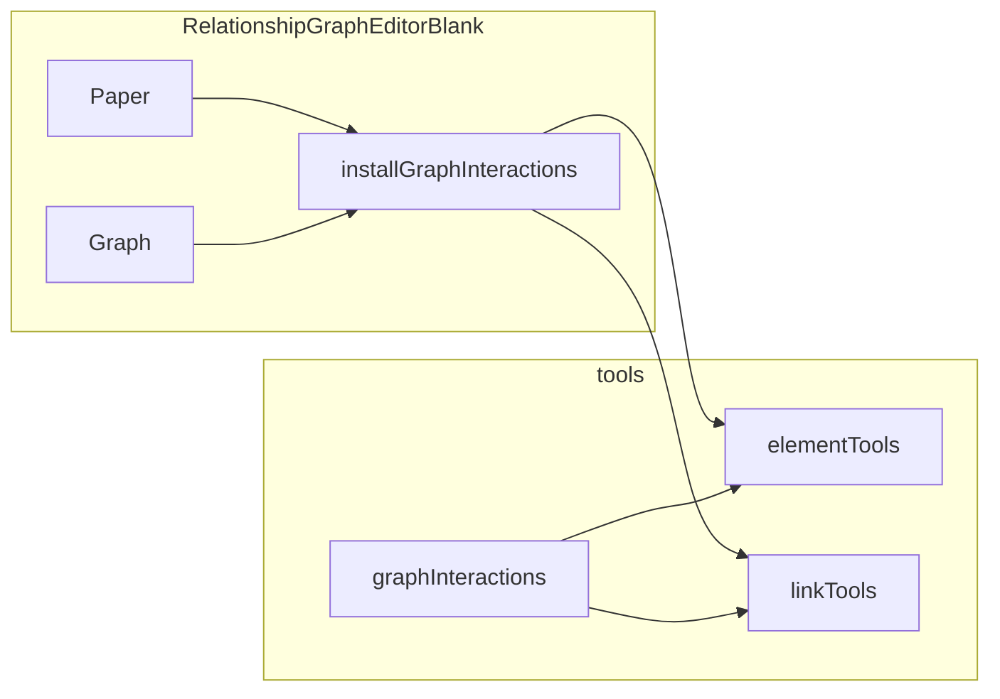

# Hover and selection for RelationshipGraphEditorBlank

## Current state

- **Elements**: [characterElement.ts](src/characters/components/CharacterWorkspace/components/RelationshipGraphEditorBlank/elements/characterElement.ts) already has selectors `plate`, `plateAccent`, `selectionStroke`, `selectionGlowRect`, `selectionAccent`, `avatarRing`. Blank placeholder uses the same CharacterCard.
- **Links**: [relationshipLink.ts](src/characters/components/CharacterWorkspace/components/RelationshipGraphEditorBlank/links/relationshipLink.ts) has `line`, `underlay`, `markerTarget`, `labelBody`.
- **Tools**: [elementTools.ts](src/characters/components/CharacterWorkspace/components/RelationshipGraphEditorBlank/tools/elementTools.ts) and [linkTools.ts](src/characters/components/CharacterWorkspace/components/RelationshipGraphEditorBlank/tools/linkTools.ts) currently use a **WeakMap** to store per-cell `{ hovered, selected }` and apply visual state from that.
- **Facade**: [facade.ts](src/characters/components/CharacterWorkspace/components/RelationshipGraphEditorBlank/facade.ts) stays as the **editor** API only. Interaction (selection, events) lives in tools.
- **Workspace**: Character workspace uses **Zustand** ([character-workspace-store.tsx](src/characters/components/CharacterWorkspace/store/character-workspace-store.tsx)) and viewState slice for UI state; props include `selectedNodeId`, `onNodeSelect`, `onEdgeClick`.

---

## Why WeakMap was used (and why we’re changing it)

**WeakMap in the current tools:**

- **Purpose**: Store `{ hovered, selected }` keyed by `dia.Cell` (element or link model) so we know how to style each cell.
- **Benefits**: When a cell is removed from the graph and no longer referenced, the WeakMap entry can be GC’d — no leak. State is module-local and doesn’t touch the graph model.

**Why move away from it:**

1. **Hidden state**: Selection/hover live in module-level WeakMaps. The “source of truth” is scattered (elementTools + linkTools). Harder to reason about and test.
2. **Not aligned with the rest of the app**: The workspace already uses Zustand for view state and passes `selectedNodeId` / `onNodeSelect`. Selection is conceptually “who is selected” (an id), not “per-cell flags in two WeakMaps.”
3. **Clear selection**: The parent needs to be able to clear selection (e.g. toolbar, blank click). With WeakMap, only the module that holds the map can clear; we’d expose `clearSelection()` that reaches into both tools. With a single source of truth (e.g. `selectedCellId` in one place), clearing is “set selectedCellId = null and re-apply visuals” — one place, easy to expose.

**Design we want:**

- **Single source of truth**: The **interaction layer** (graphInteractions) holds `selectedCellId: string | null` and `hoveredCellId: string | null` (or one small state object). No WeakMaps.
- **Pure tools**: elementTools and linkTools only **apply** visual state. They take `(cell, { hovered, selected })` and set attrs. No internal state.
- **Flow**: On cell click → interaction layer sets `selectedCellId`, resolves cell via `graph.getCell(id)`, clears previous cell’s selection (by id), applies selection to new cell via tools. On blank click or parent call → clear selection (set selectedCellId = null, clear previous cell’s visuals). Hover: same idea with `hoveredCellId` and mouseenter/mouseleave.

This matches “explicit state + pure apply” and fits with exposing `getSelection()` / `clearSelection()` on the ref and optional `onSelectionChange(selection)` so the parent can sync to Zustand if desired.

---

## Architecture

- **tools/elementTools** and **tools/linkTools**: **Pure** — `applyElementVisualState(el, { hovered, selected })`, `applyLinkVisualState(link, { hovered, selected })`. No WeakMap; state is passed in.
- **tools/graphInteractions**: Holds `selectedCellId` and `hoveredCellId`; subscribes to Paper/Graph events; resolves cells by id; calls apply functions; returns facade with `destroy`, `getSelection`, `clearSelection`.
- **facade.ts**: Unchanged (editor API only).
- **Ref**: Exposes `getSelection()` and **`clearSelection()`** so the parent can clear selection when needed.

---

## Implementation

### 1. Refactor tools to be pure (remove WeakMap)

**elementTools.ts**

- Remove WeakMap and getState.
- Change to: `applyElementVisualState(el: dia.Element, state: { hovered: boolean; selected: boolean })` — compute stroke/width/opacity from `state` and set attrs.
- Keep exports: `applyElementVisualState`. Remove `setElementHovered`, `setElementSelected`, `clearElementSelected` (callers will call `applyElementVisualState(cell, { hovered, selected })` instead).

**linkTools.ts**

- Same idea: remove WeakMap; `applyLinkVisualState(link: dia.Link, state: { hovered: boolean; selected: boolean })` only.
- Remove setLinkHovered, setLinkSelected, clearLinkSelected.

### 2. Add `tools/graphInteractions.ts`

- **State**: `selectedCellId: string | null`, `hoveredCellId: string | null` (closure or a small object).
- **Selection type**: `{ type: 'element' | 'link' | null; id: string | null }`.
- **Facade**: `{ destroy(); getSelection(): Selection; clearSelection(): void }`.
- **installGraphInteractions({ paper, graph, onSelectionChange? })**:
  - On `cell:mouseenter`: set `hoveredCellId = cell.id`, clear previous hovered cell’s hover (graph.getCell(hoveredCellId) → apply with hovered: false), apply hover to new cell (apply with hovered: true). Use same pattern for element vs link (applyElementVisualState / applyLinkVisualState).
  - On `cell:mouseleave`: clear hovered cell’s hover, set `hoveredCellId = null`.
  - On `cell:pointerclick`: clear previous selected cell’s selection (by selectedCellId), set `selectedCellId = cell.id`, apply selection to clicked cell; build `selection` and call `onSelectionChange?.(selection)`.
  - On `blank:pointerdown`: clear selection (clear previous selected cell’s visuals, set selectedCellId = null, emit).
  - On graph `remove`: if removed cell id === selectedCellId or hoveredCellId, clear that and update visuals.
  - Subscribe to paper (cell:mouseenter, cell:mouseleave, cell:pointerclick, blank:pointerdown) and graph (remove). Return facade with destroy (off all), getSelection, clearSelection.

When applying “clear selection” or “set selection”, always: resolve cell by id with `graph.getCell(id)`, then call `applyElementVisualState(el, { hovered: ..., selected: false })` or `applyLinkVisualState(link, { hovered: ..., selected: false })` (and for the new selected/hovered cell, pass true). So the interaction layer is the only place that knows current selected/hovered ids.

### 3. Export from `tools/index.ts`

- `export * from './graphInteractions';` (and export `Selection` / `GraphInteractionFacade` if not re-exported via `export *`).

### 4. Wire in RelationshipGraphEditorBlank.tsx

- In the same useEffect where paper/graph are created and populated: after initial load, call `installGraphInteractions({ paper, graph, onSelectionChange })` and store the return value in a ref (e.g. `interactionsRef`).
- Cleanup: `interactionsRef.current?.destroy()` and set ref to null.
- If `interactive: false` prevents pointer events, set `interactive: true` (or the minimal option that allows pointer events).

### 5. Expose getSelection and clearSelection on ref

- In [types.ts](src/characters/components/CharacterWorkspace/components/RelationshipGraphEditorBlank/types.ts): extend `RelationshipGraphEditorBlankRef` with:
  - `getSelection(): Selection` (or equivalent type)
  - `clearSelection(): void`
- In the component: assign these from `interactionsRef.current` in the ref object passed to `useImperativeHandle` (so the parent can clear selection and read current selection).

### 6. Optional: wire onSelectionChange to props

- The component already has `onNodeSelect?: (nodeId: string | null)` and `onEdgeClick?: (edgeId: string)` in props. When building `selection` in graphInteractions, call `onSelectionChange(selection)`; the parent can then call `onNodeSelect(selection.type === 'element' ? selection.id : null)` and `onEdgeClick` when type === 'link', or a single callback — as needed for the parent to sync to Zustand.

---

## File summary

| Action | File |

|--------|------|

| Refactor | `tools/elementTools.ts` — pure `applyElementVisualState(el, { hovered, selected })`, remove WeakMap and set/clear helpers |

| Refactor | `tools/linkTools.ts` — pure `applyLinkVisualState(link, { hovered, selected })`, remove WeakMap and set/clear helpers |

| Add | `tools/graphInteractions.ts` — state (selectedCellId, hoveredCellId), installGraphInteractions, event binding, getSelection, clearSelection |

| Edit | `tools/index.ts` — export graphInteractions |

| Edit | `RelationshipGraphEditorBlank.tsx` — install graphInteractions, cleanup, expose getSelection + clearSelection on ref; adjust interactive if needed |

| Edit | `types.ts` — add getSelection() and clearSelection() to RelationshipGraphEditorBlankRef |

---

## Token usage

Reuse existing theme tokens as in current tools (no new CSS variables).