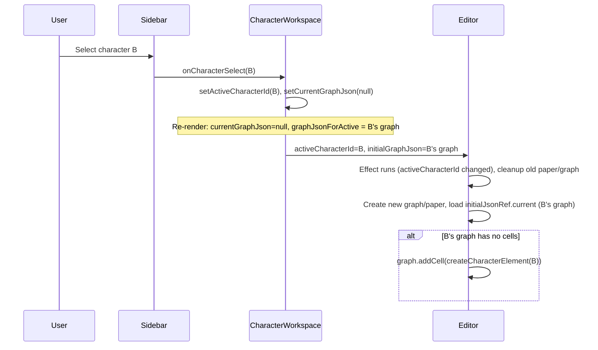

# Per-character graph load

## Problem

1. **Editor never reloads**: [RelationshipGraphEditorBlank.tsx](src/characters/components/CharacterWorkspace/components/RelationshipGraphEditorBlank/RelationshipGraphEditorBlank.tsx) mounts the JointJS graph/paper in an effect with empty deps `[]`, so it runs only once. When the user selects a different character in [CharacterSidebar](src/characters/components/CharacterWorkspace/components/CharacterSidebar/CharacterSidebar.tsx), the parent updates `activeCharacterId` and (one frame later) `currentGraphJson`, but the editor never tears down and re-inits with the new character's graph.

2. **One-frame lag**: [CharacterWorkspace.tsx](src/characters/components/CharacterWorkspace/CharacterWorkspace.tsx) loads the new character's graph in a `useEffect` (lines 135–148), so `currentGraphJson` updates after the first render that already has the new `activeCharacterId`. The editor can receive the new character id with the previous character's graph for one frame.

3. **Empty graph rule**: When the loaded graph has no cells, the editor should add the active character as the first element (the graph always belongs to that character).

## Approach

- **Parent (CharacterWorkspace)**: Derive the “graph for active character” and pass it when local `currentGraphJson` is null so the editor gets the correct JSON on the same render when switching character. On character select, clear local graph state so that derived value is used.
- **Editor (RelationshipGraphEditorBlank)**: Re-run the init effect when `activeCharacterId` changes (teardown + create new graph/paper, load JSON, and if no cells add the active character element).

## Implementation

### 1. CharacterWorkspace.tsx

- **Derive graph for active character**  

Add a `useMemo`: `graphJsonForActive = activeCharacterId ? (charactersById[activeCharacterId]?.relationshipGraphJson ?? null) : null`, keyed by `[activeCharacterId, charactersById]`.

- **Pass combined initial graph to editor**  

Use `initialGraphJson={currentGraphJson ?? graphJsonForActive}` so when `currentGraphJson` is null (e.g. right after switching character), the editor receives the new character's saved graph in the same render.

- **Clear graph state on character switch**  

In `handleCharacterSelect`, after `actions.setActiveCharacterId(characterId)`, call `setCurrentGraphJson(null)`. That way the next render uses `graphJsonForActive` for the newly active character.

### 2. RelationshipGraphEditorBlank.tsx

- **Effect dependencies**  

Change the init effect dependency array from `[]` to `[activeCharacterId]`. Keep `initialJsonRef.current = initialGraphJson` so the ref always holds the latest prop.

- **Load logic when effect runs**  

After creating the graph and paper:

  - If `initialJsonRef.current` exists and has a non-empty `cells` array, call `graph.fromJSON(initialJsonRef.current)`.
  - Otherwise (null, no `cells`, or empty `cells`), add a single element: `createCharacterElement(activeCharacter)` when `activeCharacter` is defined, otherwise `createBlankPlaceholderElement()`.

- **Cleanup**  

The existing cleanup (remove paper, null refs, remove container) already runs when the effect re-runs; no change needed there.

### 3. No changes to facade or CharacterSidebar

- [facade.ts](src/characters/components/CharacterWorkspace/components/RelationshipGraphEditorBlank/facade.ts) and [CharacterSidebar.tsx](src/characters/components/CharacterWorkspace/components/CharacterSidebar/CharacterSidebar.tsx) do not need changes. The sidebar already calls `onCharacterSelect(characterId)`; the parent will own clearing graph state and deriving `graphJsonForActive`, and the editor will react to `activeCharacterId`.

## Flow after change

## Empty-graph check

Use the same condition as today: `json && 'cells' in json && json.cells && json.cells.length > 0` to decide “has content”; otherwise treat as empty and add the active character element (or placeholder).