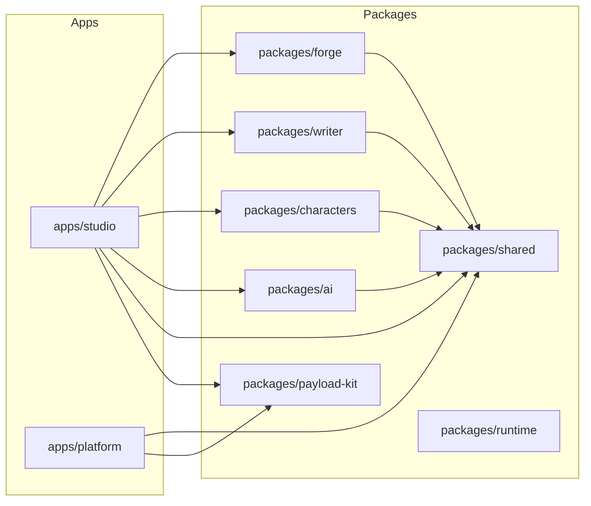

# Studio / platform split, adapter removal, and type consolidation

## Current state (summary)

- **Single app** `[apps/host](apps/host)`: one Next app with Payload, routes for forge, writer, characters, home, payload admin. (Video and game player removed in Phases 1–2.)
- **Data flow (Phase 3 done)**: App creates adapters in app code (`[createForgeAdapter](apps/host/app/lib/forge/forge-adapter.ts)`, `[createWriterAdapter](apps/host/app/lib/writer/writer-adapter.ts)`, `[createCharacterAdapter](apps/host/app/lib/characters/character-adapter.ts)`, `[createAiDataAdapter](apps/host/app/lib/ai/ai-data-adapter.ts)`) using a shared `[payload](apps/host/app/lib/forge/payload.ts)` SDK instance. These implement adapter interfaces defined in packages. Adapters are provided to workspaces via **context** (`ForgeDataContext`, `WriterDataContext`); no `dataAdapter` props. Old `payload-*-adapter` files and `data-adapter/` folders removed.
- **Types**: `[apps/host/app/payload-types.ts](apps/host/app/payload-types.ts)` (generated); packages define their own doc types (e.g. `ForgeGraphDoc`, `ForgePage`). Phase 4 will consolidate on Payload types at app level.

---

## Target structure (aligned with your forge-agent sketch)

- **Two apps**, each with its own Payload config and DB:
  - `**apps/studio**` (current host minus video): forge, writer, characters, AI workspaces; Payload collections: projects, forge-graphs, pages, characters, flag-schemas, game-states, media, etc. (no video-templates).
  - `**apps/platform**` (new): marketing/docs; Payload collections: pages, posts, changelog, docs, pricing, media.
- **No data adapters**: Studio (and later platform) use **React Query hooks** that call **Payload SDK** directly; types come from **Payload-generated types** for that app. Domains receive data via props/context from these hooks, not adapter interfaces.
- **Shared types at app level**: In studio, `payload-types.ts` is the source of truth; hooks return `Project`, `ForgeGraph`, `Page`, etc. Forge/Writer packages either accept these types at boundaries or a minimal shared type set (e.g. in `packages/shared` or a small `payload-kit`) so we don’t duplicate Payload shapes per domain.
- **Removed**: All video (package, routes, lib, collections, Remotion), game player (GamePlayer, PlayView, ForgePlayModal, WriterPlayModal, play state in stores), and adapter interfaces/implementations once hooks replace them.

---

## Phase 1: Remove video and Remotion

- **Delete**:
  - `[packages/video](packages/video)` (entire package).
  - `[apps/host/app/(video)](apps/host/app/(video)`) (route, layout, page, VideoStudio, copilot).
  - `[apps/host/app/lib/video/](apps/host/app/lib/video/)` (payload-video-template-adapter, payload-project-adapter, payload-media-resolver, map-template-overrides, types).
  - Remotion-related deps from `[packages/dialogue-forge/package.json](packages/dialogue-forge/package.json)` (and any from host if present).
- **Forge package**:
  - Remove all `@magicborn/video` imports and usage: `[PlayView](packages/forge/src/components/ForgeWorkspace/components/GraphEditors/shared/PlayView.tsx)` (video template state/overrides), `[forge-workspace-store](packages/forge/src/components/ForgeWorkspace/store/forge-workspace-store.tsx)` (`videoTemplateAdapter`, `videoTemplateOverrides`), `[ForgeWorkspace](packages/forge/src/components/ForgeWorkspace/ForgeWorkspace.tsx)` (video adapter/overrides props), `[useForgeWorkspaceCompositionCompiler](packages/forge/src/components/ForgeWorkspace/hooks/useForgeWorkspaceCompositionCompiler.ts)` (video composition types). Either remove PlayView’s video bits and keep a minimal PlayView for later, or remove PlayView in Phase 2 with the game player.
  - Remove video from `[packages/forge](packages/forge)` exports if any.
- **Host**:
  - `[(forge)/forge/page.tsx](apps/host/app/(forge)`/forge/page.tsx): remove `makePayloadVideoTemplateAdapter`, `mapVideoTemplateOverrides`, `videoTemplateAdapter`, `videoTemplateOverrides`, and related props on `ForgeWorkspace`.
  - Payload: remove `video-templates` from `[payload.config](apps/host/app/payload.config.ts)` and from `[payload-collections](apps/host/app/payload-collections/)` (config + enums); remove seeds referencing video. Regenerate payload-types.
- **Root**: Remove `packages/video` from workspace; pnpm install; fix any remaining references (e.g. dialogue-forge re-export of video).

---

## Phase 2: Remove game player

- **Forge**:
  - Remove `[GamePlayer](packages/forge/src/components/ForgeWorkspace/components/GamePlayer/)` (and `[VNStage](packages/forge/src/components/ForgeWorkspace/components/GamePlayer/VNStage.tsx)`), `[PlayView](packages/forge/src/components/ForgeWorkspace/components/GraphEditors/shared/PlayView.tsx)`, `[ForgePlayModal](packages/forge/src/components/ForgeWorkspace/components/GraphEditors/ForgeWorkSpaceModals/ForgePlayModal.tsx)`.
  - In `[ForgeWorkspaceModals](packages/forge/src/components/ForgeWorkspace/components/GraphEditors/ForgeWorkSpaceModals/ForgeWorkspaceModals.tsx)`: stop rendering ForgePlayModal; remove `openPlayModal` / `closePlayModal` from store usage there.
  - In forge store (`[viewState.slice](packages/forge/src/components/ForgeWorkspace/store/slices/viewState.slice.ts)`): remove `isPlayModalOpen`, `openPlayModal`, `closePlayModal`.
  - In `[ForgeWorkspace](packages/forge/src/components/ForgeWorkspace/ForgeWorkspace.tsx)`: remove `onPlayClick` / play button and any play-modal wiring.
  - In `[ForgeStoryletGraphEditor](packages/forge/src/components/ForgeWorkspace/components/GraphEditors/ForgeStoryletGraphEditor/ForgeStoryletGraphEditor.tsx)` (and narrative editor if present): remove play button and `openPlayModal`.
  - In `[GuidePanel](packages/forge/src/components/ForgeWorkspace/components/GraphEditors/shared/GuidePanel.tsx)`: remove or rewrite GamePlayer/PlayView examples and references.
  - In `[packages/forge/src/index.ts](packages/forge/src/index.ts)`: remove exports for `GamePlayer`, `PlayView`, and game-state-flattener if we remove it; else keep flattener for potential future use.
  - Option: keep `[game-state-flattener](packages/forge/src/lib/game-player/game-state-flattener.ts)` as a pure util (no UI) for future execution; otherwise delete the whole `[lib/game-player](packages/forge/src/lib/game-player)` (and docs).
- **Writer**:
  - Remove `[WriterPlayModal](packages/writer/src/components/WriterWorkspace/modals/components/WriterPlayModal.tsx)` and its use in `[WriterWorkspaceModals](packages/writer/src/components/WriterWorkspace/modals/WriterWorkspaceModals.tsx)`.
  - In writer store (`[viewState.slice](packages/writer/src/components/WriterWorkspace/store/slices/viewState.slice.ts)`): remove `isPlayModalOpen`, `openPlayModal`, `closePlayModal`.
  - Remove any “play” button or open-play-modal calls in Writer UI.

---

## Phase 3: Replace adapters with React Query + Payload SDK (studio app)

- **Principle**: No adapter interfaces in packages; app provides data via React Query hooks that use Payload SDK and Payload-generated types. Workspaces receive data (and mutation callbacks) via props or context.
- **Studio app (current host)**:
  - **Hooks** (extend existing pattern in `[apps/host/app/lib/forge/queries.ts](apps/host/app/lib/forge/queries.ts)`):
    - Forge: e.g. `useProjects`, `useCreateProject`, `useGraphs(projectId)`, `useGraph(id)`, `useUpdateGraph`, `useDeleteGraph`, `usePages(projectId, narrativeGraphId?)`, `useCharacters(projectId)`, `useFlagSchema(projectId)`, `useGameStates(projectId)`, etc. All use `PayloadSDK` and return Payload types (`Project`, `ForgeGraph`, `Page`, `Character`, etc.).
    - Writer: e.g. `usePages(projectId, narrativeGraphId?)`, `usePage(id)`, `useUpdatePage`, `useCreatePage`, `useDeletePage` (can share with forge if same collection). Add media/comment hooks if writer needs them.
    - Characters / AI: same idea—hooks that wrap Payload SDK, using studio’s payload-types.
  - **Remove**:
    - `[apps/host/app/lib/forge/data-adapter/payload-forge-adapter.ts](apps/host/app/lib/forge/data-adapter/payload-forge-adapter.ts)` and any other payload-*-adapter files.
    - `[apps/host/app/lib/writer/data-adapter/payload-writer-adapter.ts](apps/host/app/lib/writer/data-adapter/payload-writer-adapter.ts)`.
    - `[apps/host/app/lib/ai/data-adapter/payload-ai-adapter.ts](apps/host/app/lib/ai/data-adapter/payload-ai-adapter.ts)`.
    - `[apps/host/app/lib/characters/payload-character-adapter.ts](apps/host/app/lib/characters/payload-character-adapter.ts)` if present.
  - **ForgeWorkspace** (in forge package):
    - Change from `dataAdapter={makePayloadForgeAdapter()}` to props such as `projects`, `selectedProjectId`, `onProjectChange`, and optionally a **queries object** (e.g. `useGraphs`, `useGraph`, `useUpdateGraph`) or a **context** that provides the same. Forge workspace internals call these hooks at the app boundary (e.g. in a wrapper in studio) or receive pre-fetched data and mutation callbacks. Preferred: **app-level wrapper** in studio that uses the hooks and passes data/callbacks into ForgeWorkspace so the forge package stays free of Payload/host types.
  - **WriterWorkspace** (in writer package):
    - Same idea: remove `dataAdapter` and `forgeDataAdapter`; Writer receives data and mutation handlers from studio (via wrapper that uses the new hooks). Writer’s internal types can stay minimal (e.g. “page doc” shape) and studio maps Payload `Page` to that shape at the boundary if needed.
  - **Characters / AI**: Same pattern—remove adapter injection; studio provides data via hooks and passes into workspace components.
- **Package-side**:
  - Remove or narrow **adapter interfaces** from packages: `[ForgeDataAdapter](packages/forge/src/adapters/forge-data-adapter.ts)`, `[WriterForgeDataAdapter](packages/writer/src/types/forge-data-adapter.ts)`, `[WriterDataAdapter](packages/writer/src/lib/data-adapter/writer-adapter.ts)`, and AI/character adapter types. Replace with either (a) no interface (workspace receives data/callbacks via props/context) or (b) a minimal “data provider” type that the app implements with the new hooks.
  - Update all **subscriptions / store slices** in forge, writer, characters, ai that currently call `dataAdapter.*` to instead get data from props/context (or from a context that the app provides backed by React Query).

---

## Phase 4: Use Payload types at app level and share across domains

- **Single type source for studio**: Keep `[payload-types.ts](apps/host/app/payload-types.ts)` (later under `apps/studio`) as the source of truth for Project, ForgeGraph, Page, Character, etc.
- **Hooks return Payload types**: e.g. `useGraphs()` returns `ForgeGraph[]` (from payload-types), not `ForgeGraphDoc[]`. Where the domain currently expects a different shape (e.g. `ForgeGraphDoc` with `project: number`), either:
  - Use Payload types in the domain at the boundary (preferred): forge/writer components accept `ForgeGraph` / `Page` and use their fields; or
  - Keep a single shared “view” type in `packages/shared` (or payload-kit) that matches Payload and is re-exported for domains, avoiding per-domain duplicates.
- **Remove duplicate domain types** that mirror Payload: e.g. if `ForgeGraphDoc` in forge is the same shape as Payload’s `ForgeGraph`, migrate to use Payload type in the app and pass through; if forge internals need a different shape, keep a minimal internal type and map at the boundary (app → workspace) once.
- **Regenerate payload-types** after any collection changes (e.g. removing video-templates) and fix imports across the app.

---

## Phase 5: Rename host → studio and add platform app

- **Rename** `apps/host` → `apps/studio` (package name e.g. `@magicborn/studio`). Update root scripts (`build:host` → `build:studio`, `dev`, etc.), Vercel/CI, and docs.
- **Studio Payload**: Already scoped to studio collections (no video). Optionally move payload config and collections under `apps/studio/payload/` (e.g. `payload.config.ts`, `collections/`) to align with your sketch.
- **Create** `apps/platform`:
  - Next app with its own `payload.config.ts` and collections: pages, posts, changelog, docs, pricing, media. No forge/writer/character/ai workspaces.
  - Simple marketing layout and routes (e.g. home, docs, blog, pricing). Can start minimal (single landing page) and add routes later.
- **Docs structure** (optional but matches your layout): Add or align `docs/STATUS.md`, `docs/architecture/` (e.g. `studio-app.md`, `platform-app.md`), `docs/guides/`, `docs/design/` and reference in AGENTS.md.

---

## Phase 6: Optional payload-kit and shared init

- **payload-kit** (optional): New package `packages/payload-kit` with shared helpers: Payload init pattern, optional access/field helpers. Used by both studio and platform so each app’s `payload.config.ts` stays thin. Not a “layer” that domains depend on—only apps depend on it.
- **Shared types**: If both apps need a common subset (e.g. Media), that can live in payload-kit or a small shared types file that both apps’ payload-types extend or reference.

---

## Dependency graph (after changes)

- **No** packages import app or payload-types; apps import packages and use Payload SDK + payload-types in hooks; data flows app → workspaces via props/context.

---

## Order of execution (recommended)

1. **Phase 1** (video + Remotion removal): Unblocks forge from video; gets rid of video package and routes.
2. **Phase 2** (game player removal): Removes PlayView/GamePlayer/PlayModals and play state; simplifies forge and writer.
3. **Phase 3** (adapters → hooks): Introduce hooks in the current host app and refactor ForgeWorkspace/WriterWorkspace to consume them (via wrapper or context); then delete adapters and adapter interfaces. This is the largest change; do one workspace at a time (e.g. forge first, then writer, then characters/ai).
4. **Phase 4** (types): Consolidate on Payload types in the app and remove or narrow duplicate domain types; ensure a single source of truth.
5. **Phase 5** (rename host → studio, add platform): Structural rename and new app; adjust CI/Vercel.
6. **Phase 6** (payload-kit): Optional; add when you want to share init/helpers between studio and platform.

---

## Risks and mitigations

- **Build breakage**: Run `pnpm install`, `pnpm run build`, and typecheck after each phase; fix broken imports and types before moving on.
- **Forge/Writer store refactor**: Subscriptions and slices that today call `dataAdapter` will need to get data from React Query (e.g. via a context that exposes query results and mutations). Design that context in the app so packages stay adapter-agnostic.
- **Payload type drift**: After removing collections (video-templates) or splitting DBs, regenerate payload-types and update hooks and components that reference old shapes.

