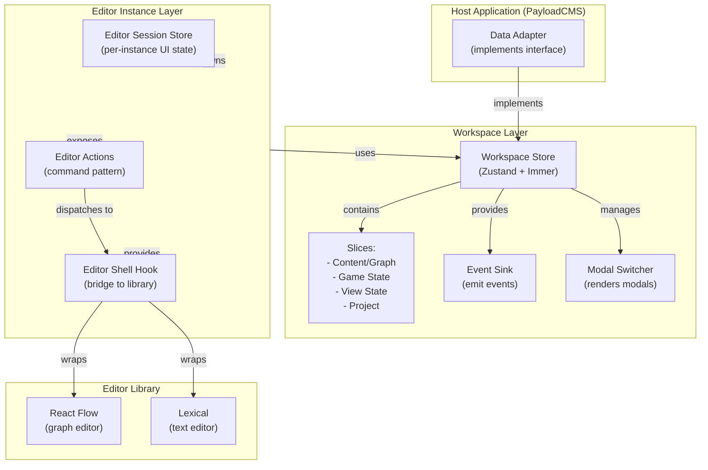
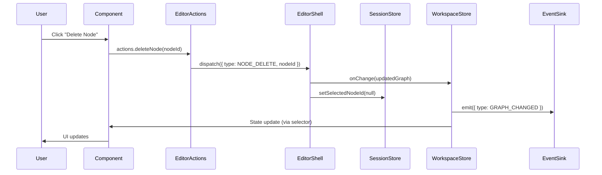
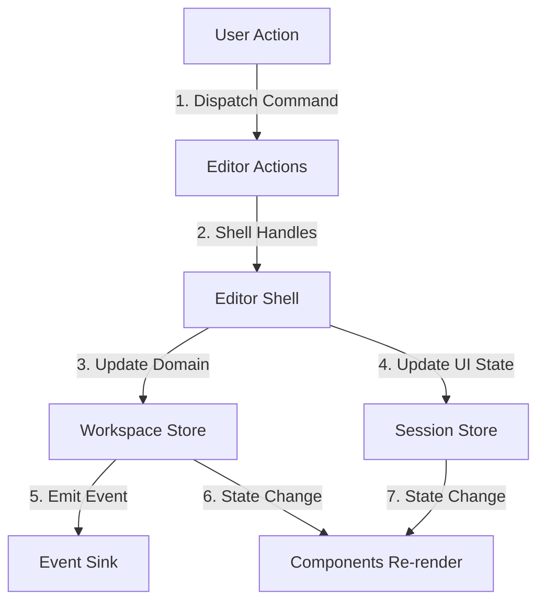

# Workspace Editor Architecture Guide

## Overview

This document explains the layered architecture pattern used in Dialogue Forge workspaces, focusing on state management, editor shells, command patterns, and modal management. The architecture separates concerns into distinct layers that communicate through well-defined boundaries.

## Architecture Layers

### Layer Diagram



### State Ownership Diagram

```mermaid
graph LR
    subgraph Persistent["Persistent State<br/>(Workspace Store)"]
        Graphs["Graphs<br/>(domain data)"]
        GameState["Game State<br/>(flags, etc.)"]
        ModalState["Modal State<br/>(which modals open)"]
        PanelLayout["Panel Layout<br/>(sidebar visibility)"]
    end
    
    subgraph Ephemeral["Ephemeral State<br/>(Editor Session Store)"]
        SelectedNode["Selected Node ID<br/>(current selection)"]
        LayoutDir["Layout Direction<br/>(TB/LR)"]
        AutoOrg["Auto Organize<br/>(toggle)"]
        PathHighlight["Path Highlight<br/>(toggle)"]
    end
    
    subgraph LibraryState["Library State<br/>(React Flow/Lexical)"]
        ReactFlowNodes["React Flow Nodes<br/>(internal)"]
        LexicalState["Lexical Editor State<br/>(internal)"]
    end
    
    Persistent -->|"read-only context"| Ephemeral
    Ephemeral -->|"controls"| LibraryState
    LibraryState -->|"events →"| Ephemeral
    Ephemeral -->|"mutations →"| Persistent
```



## Core Concepts

### 1. Workspace Store (Domain State)

**Purpose**: Manages persistent domain state that lives across the workspace lifecycle.

**Location**: `src/{domain}/components/{Domain}Workspace/store/{domain}-workspace-store.tsx`

**Characteristics**:

- Uses Zustand with Immer middleware
- Composed of slices (content, gameState, viewState, project)
- Persists across editor instance changes
- Emits events via EventSink
- Contains data adapter reference

**Example Slice Structure**:

```typescript
// src/forge/components/ForgeWorkspace/store/slices/viewState.slice.ts
export interface ViewStateSlice {
  graphScope: "narrative" | "storylet"
  modalState: ModalState  // ← Modal state lives here
  panelLayout: PanelLayoutState
  focusedEditor: "narrative" | "storylet" | null
}

export interface ViewStateActions {
  openPlayModal: () => void
  closePlayModal: () => void
  openFlagModal: () => void
  // ... other modal actions
}
```

### 2. Editor Session Store (Per-Instance UI State)

**Purpose**: Manages ephemeral UI state specific to a single editor instance.

**Location**: `src/{domain}/components/{Domain}Workspace/components/{Editor}/hooks/use{Editor}Session.tsx`

**Characteristics**:

- Separate Zustand store per editor instance
- Lives only while editor is mounted
- Contains UI preferences (layout direction, toggles, selection)
- Does NOT contain domain data

**Example**:

```typescript
// src/forge/components/ForgeWorkspace/components/GraphEditors/hooks/useForgeEditorSession.tsx
export interface ForgeEditorSessionState {
  selectedNodeId: string | null;  // ← UI state, not domain
  paneContextMenu: { x: number; y: number } | null;
  layoutDirection: LayoutDirection;  // ← Editor preference
  autoOrganize: boolean;
  showPathHighlight: boolean;
}
```

**When to Use**:

- Selection state (which node is selected)
- UI toggles (show minimap, auto-organize)
- Editor preferences (layout direction)
- Temporary UI state (context menus, tooltips)

**When NOT to Use**:

- Domain data (graphs, flags, game state) → Use Workspace Store
- Modal state → Use Workspace Store viewState slice
- Persistent preferences → Use Workspace Store

### 3. Editor Shell (Bridge Pattern)

**Purpose**: Bridges editor library (React Flow, Lexical) with domain logic and workspace state.

**Location**: `src/{domain}/components/{Domain}Workspace/components/{Editor}/hooks/use{Editor}Shell.ts`

**Characteristics**:

- Custom hook that wraps editor library
- Handles library events (onNodesChange, onChange, etc.)
- Converts library events to domain mutations
- Provides command dispatch function
- Manages synchronization between library state and domain state

**Example Structure**:

```typescript
// useForgeFlowEditorShell.ts
export function useForgeFlowEditorShell(args: {
  graph: ForgeGraphDoc | null;
  onChange: (graph: ForgeGraphDoc) => void;
  reactFlow: ReactFlowInstance;
  sessionStore: ForgeEditorSessionStore;
}) {
  // Read from session store
  const selectedNodeId = useStore(sessionStore, s => s.selectedNodeId);
  
  // Handle React Flow events
  const onNodesChange = (changes: NodeChange[]) => {
    // Update React Flow state
    setNodes(applyNodeChanges(changes, nodes));
    
    // Sync to domain graph
    const nextGraph = applyChangesToGraph(graph, changes);
    onChange(nextGraph);
  };
  
  // Command dispatcher
  const dispatch = (cmd: ForgeCommand) => {
    switch (cmd.type) {
      case FORGE_COMMAND.GRAPH.NODE_PATCH:
        handleUpdateNode(cmd.nodeId, cmd.updates);
        break;
      // ... other commands
    }
  };
  
  return {
    nodes,
    edges,
    selectedNodeId,
    dispatch,  // ← Command dispatcher
    onNodesChange,
    // ... other handlers
  };
}
```

**When to Use Editor Shell**:

- Editor library has complex event system (React Flow, Lexical)
- Need to synchronize library state with domain state
- Editor has multiple interaction modes (drag, select, connect)
- Need command pattern for actions

**When NOT to Use Editor Shell**:

- Simple form inputs → Direct component with workspace store actions
- Static displays → Direct component
- Simple editors with built-in state management that already aligns with domain patterns

### 4. Command Pattern

**Purpose**: Provides typed, testable actions that abstract dispatch logic.

**Location**:

- Commands: `src/{domain}/components/{Domain}Workspace/components/{Editor}/hooks/{domain}-commands.ts`
- Actions: `src/{domain}/components/{Domain}Workspace/components/{Editor}/hooks/use{Editor}Actions.tsx`

**Structure**:

```typescript
// forge-commands.ts
export const FORGE_COMMAND = {
  UI: {
    SELECT_NODE: 'UI.SELECT_NODE',
    OPEN_NODE_EDITOR: 'UI.OPEN_NODE_EDITOR',
  },
  GRAPH: {
    NODE_CREATE: 'GRAPH.NODE_CREATE',
    NODE_PATCH: 'GRAPH.NODE_PATCH',
    NODE_DELETE: 'GRAPH.NODE_DELETE',
  },
} as const;

export type ForgeCommand =
  | { type: typeof FORGE_COMMAND.UI.SELECT_NODE; nodeId: string }
  | { type: typeof FORGE_COMMAND.GRAPH.NODE_PATCH; nodeId: string; updates: Partial<ForgeNode> }
  // ... other commands
```

**Actions Factory**:

```typescript
// useForgeEditorActions.tsx
export function makeForgeEditorActions(
  dispatch: (cmd: ForgeCommand) => void
): ForgeEditorActions {
  return {
    patchNode: (nodeId, updates) => 
      dispatch({ type: FORGE_COMMAND.GRAPH.NODE_PATCH, nodeId, updates }),
    deleteNode: (nodeId) => 
      dispatch({ type: FORGE_COMMAND.GRAPH.NODE_DELETE, nodeId }),
    // ... other actions
  };
}
```

**Usage in Components**:

```typescript
// In editor component
const shell = useForgeFlowEditorShell({ ... });
const actions = useMemo(() => makeForgeEditorActions(shell.dispatch), [shell.dispatch]);

return (
  <ForgeEditorActionsProvider actions={actions}>
    <NodeEditor
      node={selectedNode}
      onUpdate={(updates) => {
        // Use action, not direct callback
        actions.patchNode(selectedNode.id, updates);
      }}
    />
  </ForgeEditorActionsProvider>
);
```

### 5. Modal Management

**Pattern**: Modals are managed in workspace store's viewState slice and rendered by a modal switcher component.

**Implementation**:

1. **Add modal state to viewState slice**:
```typescript
// viewState.slice.ts
export interface ModalState {
  isPlayModalOpen: boolean;
  isFlagModalOpen: boolean;
  isYarnModalOpen: boolean;  // ← New modal
}

export interface ViewStateActions {
  openPlayModal: () => void;
  closePlayModal: () => void;
  openYarnModal: () => void;  // ← New action
  closeYarnModal: () => void;
}
```

2. **Create modal switcher component**:
```typescript
// ForgeWorkspaceModals.tsx
export function ForgeWorkspaceModalsRenderer(props: ForgeWorkspaceModalsProps) {
  const modalState = useForgeWorkspaceStore(s => s.modalState);
  const openYarnModal = useForgeWorkspaceStore(s => s.actions.openYarnModal);
  const closeYarnModal = useForgeWorkspaceStore(s => s.actions.closeYarnModal);
  
  return (
    <>
      <ForgePlayModal
        isOpen={modalState.isPlayModalOpen}
        onClose={() => useForgeWorkspaceStore.getState().actions.closePlayModal()}
        // ... props
      />
      <ForgeYarnModal  // ← New modal
        isOpen={modalState.isYarnModalOpen}
        onClose={closeYarnModal}
        graph={props.graph}
      />
    </>
  );
}
```

3. **Components open modals via workspace actions**:
```typescript
// In toolbar component
const openYarnModal = useForgeWorkspaceStore(s => s.actions.openYarnModal);

<button onClick={openYarnModal}>
  View Yarn
</button>
```


**Benefits**:

- Single source of truth for modal state
- Easy to test (check store state)
- Consistent pattern across all modals
- Can persist modal state if needed

## Slice Organization

### Slice Principles

1. **Domain Separation**: Each slice owns a distinct domain concern
2. **No Cross-Slice Dependencies**: Slices don't import each other
3. **Shared Types File**: Use `{workspace}-types.ts` to break circular dependencies
4. **Actions Wrapped with Events**: Actions emit events via EventSink

### Example Slice Structure

```typescript
// content.slice.ts
export interface ContentSlice {
  pages: ForgePage[];
  chapters: ForgeChapter[];
  contentError: string | null;
}

export interface ContentActions {
  setPages: (pages: ForgePage[]) => void;
  updatePage: (pageId: number, patch: Partial<ForgePage>) => void;
}

export function createContentSlice(
  set: StateCreator<WriterWorkspaceState>[0],
  get: StateCreator<WriterWorkspaceState>[1],
  initialPages?: ForgePage[]
): ContentSlice & ContentActions {
  return {
    pages: initialPages ?? [],
    contentError: null,
    setPages: (pages) => set({ pages }),
    updatePage: (pageId, patch) => set((state) => ({
      pages: state.pages.map(p => p.id === pageId ? { ...p, ...patch } : p)
    })),
  };
}
```

### Recommended Slices

**For Forge Workspace**:

- `graph.slice.ts` - Graph documents and cache
- `gameState.slice.ts` - Flag schema and game state
- `viewState.slice.ts` - UI state (modals, panels, focus)
- `project.slice.ts` - Project selection

**For Writer Workspace**:

- `content.slice.ts` - Acts, chapters, pages
- `editor.slice.ts` - Drafts and save status
- `ai.slice.ts` - AI preview and proposals
- `navigation.slice.ts` - Active page, expanded items
- `viewState.slice.ts` - Modals, panel layout (to be added)

## Communication Flow

### Data Flow Diagram



### State Update Flow



## Applying to Writer Workspace

### Current State

Writer currently:

- ✅ Has workspace store with slices (content, editor, ai, navigation)
- ✅ Uses Lexical editor directly
- ❌ No editor session store
- ❌ No modal management system
- ❌ Yarn/Play views embedded in editors (should be modals)

### Recommended Changes

#### 1. Add Editor Session Store

**File**: `src/writer/components/WriterWorkspace/editor/hooks/useWriterEditorSession.tsx`

```typescript
export interface WriterEditorSessionState {
  cursorPosition: { line: number; column: number } | null;
  selectedText: string | null;
  showAiPreview: boolean;
  editorTheme: 'light' | 'dark';
}

export function createWriterEditorSessionStore() {
  return createStore<WriterEditorSessionState>()((set) => ({
    cursorPosition: null,
    selectedText: null,
    showAiPreview: true,
    editorTheme: 'dark',
  }));
}
```

**Why**: Lexical manages its own editor state, but we need UI state (cursor position for AI, selection tracking, preview toggles).

#### 2. Add ViewState Slice for Modals

**File**: `src/writer/components/WriterWorkspace/store/slices/viewState.slice.ts`

```typescript
export interface WriterModalState {
  isYarnModalOpen: boolean;
  isPlayModalOpen: boolean;
  isSettingsModalOpen: boolean;
}

export interface ViewStateSlice {
  modalState: WriterModalState;
  panelLayout: PanelLayoutState;
}

export interface ViewStateActions {
  openYarnModal: () => void;
  closeYarnModal: () => void;
  openPlayModal: () => void;
  closePlayModal: () => void;
}
```

#### 3. Create Modal Switcher

**File**: `src/writer/components/WriterWorkspace/modals/WriterWorkspaceModals.tsx`

```typescript
export function WriterWorkspaceModalsRenderer(props: WriterWorkspaceModalsProps) {
  const modalState = useWriterWorkspaceStore(s => s.modalState);
  const closeYarnModal = useWriterWorkspaceStore(s => s.actions.closeYarnModal);
  
  return (
    <>
      <WriterYarnModal
        isOpen={modalState.isYarnModalOpen}
        onClose={closeYarnModal}
        page={props.activePage}
      />
      <WriterPlayModal
        isOpen={modalState.isPlayModalOpen}
        onClose={() => useWriterWorkspaceStore.getState().actions.closePlayModal()}
        page={props.activePage}
      />
    </>
  );
}
```

#### 4. Convert Yarn/Play Views to Modals

**Before** (embedded in editor):

```typescript
{viewMode === 'yarn' && <YarnView graph={graph} />}
{viewMode === 'play' && <PlayView graph={graph} />}
```

**After** (modal):

```typescript
// In toolbar
const openYarnModal = useWriterWorkspaceStore(s => s.actions.openYarnModal);
<button onClick={openYarnModal}>View Yarn</button>

// In modal switcher (workspace level)
<WriterYarnModal isOpen={modalState.isYarnModalOpen} ... />
```

#### 5. Optional: Add Command Pattern for Writer

If Writer needs complex actions (beyond simple CRUD), add:

**File**: `src/writer/components/WriterWorkspace/editor/hooks/writer-commands.ts`

```typescript
export const WRITER_COMMAND = {
  EDITOR: {
    SET_SELECTION: 'EDITOR.SET_SELECTION',
    APPLY_AI_PATCH: 'EDITOR.APPLY_AI_PATCH',
  },
  CONTENT: {
    PAGE_CREATE: 'CONTENT.PAGE_CREATE',
    PAGE_DELETE: 'CONTENT.PAGE_DELETE',
  },
} as const;
```

**Note**: Writer's actions are simpler than Forge's, so command pattern may be overkill. Only add if actions become complex.

## Anti-Patterns

### ❌ Anti-Pattern 1: Domain Data in Session Store

```typescript
// ❌ WRONG
export interface ForgeEditorSessionState {
  graph: ForgeGraphDoc;  // ← Domain data!
  selectedNodeId: string | null;
}
```

**Why Wrong**: Session store is per-instance and ephemeral. Domain data should be in workspace store.

**✅ Correct**:

```typescript
// ✅ CORRECT
export interface ForgeEditorSessionState {
  selectedNodeId: string | null;  // ← UI state only
}

// Graph comes from workspace store
const graph = useForgeWorkspaceStore(s => s.graphs.byId[graphId]);
```

### ❌ Anti-Pattern 2: Direct Callbacks Instead of Actions

```typescript
// ❌ WRONG
<NodeEditor
  onUpdate={(updates) => {
    // Direct mutation
    setGraph({ ...graph, nodes: updatedNodes });
  }}
/>
```

**Why Wrong**: Bypasses command pattern, harder to test, no event emission.

**✅ Correct**:

```typescript
// ✅ CORRECT
const actions = useForgeEditorActions();
<NodeEditor
  onUpdate={(updates) => {
    actions.patchNode(nodeId, updates);  // ← Uses command pattern
  }}
/>
```

### ❌ Anti-Pattern 3: Modal State in Component State

```typescript
// ❌ WRONG
function Toolbar() {
  const [isModalOpen, setIsModalOpen] = useState(false);
  return (
    <>
      <button onClick={() => setIsModalOpen(true)}>Open</button>
      <Modal isOpen={isModalOpen} />
    </>
  );
}
```

**Why Wrong**: Modal state should be in workspace store for consistency and persistence.

**✅ Correct**:

```typescript
// ✅ CORRECT
function Toolbar() {
  const openModal = useForgeWorkspaceStore(s => s.actions.openPlayModal);
  return <button onClick={openModal}>Open</button>;
}

// Modal rendered at workspace level
<ForgeWorkspaceModalsRenderer />
```

### ❌ Anti-Pattern 4: Cross-Slice Imports

```typescript
// ❌ WRONG
// content.slice.ts
import { createEditorSlice } from './editor.slice';

export function createContentSlice(...) {
  const editorSlice = createEditorSlice(...);  // ← Cross-slice dependency
  return { ...contentState, ...editorSlice };
}
```

**Why Wrong**: Creates circular dependencies, tight coupling.

**✅ Correct**:

```typescript
// ✅ CORRECT
// In main store file
const contentSlice = createContentSlice(set, get);
const editorSlice = createEditorSlice(set, get);
return { ...contentSlice, ...editorSlice };
```

### ❌ Anti-Pattern 5: Editor Shell for Simple Forms

```typescript
// ❌ WRONG - Over-engineering
function useSimpleFormShell(value, onChange) {
  const dispatch = (cmd) => { /* complex logic */ };
  return { dispatch, value, onChange };
}
```

**Why Wrong**: Simple forms don't need shell pattern.

**✅ Correct**:

```typescript
// ✅ CORRECT - Direct component
function SimpleForm({ value, onChange }) {
  return <input value={value} onChange={e => onChange(e.target.value)} />;
}
```

## Decision Tree: When to Use What

```
Is this domain data that persists?
├─ YES → Workspace Store (appropriate slice)
└─ NO → Is this UI state for a specific editor instance?
    ├─ YES → Editor Session Store
    └─ NO → Is this modal state?
        ├─ YES → Workspace Store viewState slice
        └─ NO → Is this a simple form/input?
            ├─ YES → Direct component with workspace actions
            └─ NO → Does editor library have complex events?
                ├─ YES → Editor Shell + Command Pattern
                └─ NO → Direct component
```

## File Structure Reference

```
src/{domain}/
├── components/
│   └── {Domain}Workspace/
│       ├── {Domain}Workspace.tsx  (main component)
│       ├── store/
│       │   ├── {domain}-workspace-store.tsx  (main store)
│       │   ├── {domain}-workspace-types.ts  (shared types)
│       │   └── slices/
│       │       ├── content.slice.ts
│       │       ├── editor.slice.ts
│       │       ├── viewState.slice.ts  (← modals here)
│       │       └── subscriptions.ts
│       ├── components/
│       │   └── {Editor}/
│       │       ├── {Editor}.tsx
│       │       └── hooks/
│       │           ├── use{Editor}Session.tsx  (← session store)
│       │           ├── use{Editor}Shell.ts  (← shell hook)
│       │           ├── {domain}-commands.ts  (← commands)
│       │           └── use{Editor}Actions.tsx  (← actions)
│       └── modals/
│           ├── {Domain}WorkspaceModals.tsx  (← modal switcher)
│           └── components/
│               ├── {Modal}Modal.tsx
│               └── ...
```

## Summary

1. **Workspace Store**: Domain state, persistent, slice-based, emits events
2. **Editor Session Store**: Per-instance UI state, ephemeral, editor-specific
3. **Editor Shell**: Bridge between editor library and domain, handles events, provides dispatch
4. **Command Pattern**: Typed actions via dispatch, testable, consistent
5. **Modal Management**: Workspace store viewState slice + modal switcher component
6. **Slices**: Domain-separated, no cross-dependencies, shared types file

Apply this pattern consistently across Forge, Writer, and AI workspaces for maintainability and clarity.