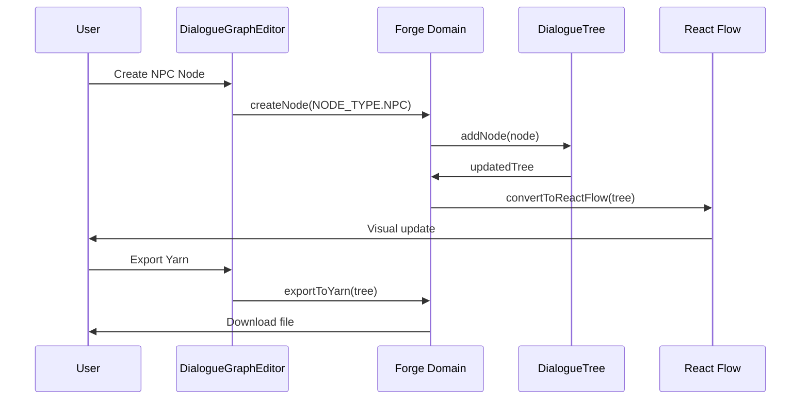

# Dialogue Forge - Architecture Documentation

## Overview

Dialogue Forge is a visual node-based dialogue editor with Yarn Spinner support for game development. It's built as an npm package (`@magicborn/dialogue-forge`) that can be used as a library or run as a standalone demo application.

## 🏗️ High-Level Architecture

### System Components

```mermaid
graph TB
    subgraph "Demo Application"
        A[Next.js App] --> B[@magicborn/dialogue-forge]
    end

    subgraph "Library (src/)"
        C[Forge Domain] --> D[Visual Graph Editor]
        E[Writer Domain] --> F[Text Editor]
        G[Shared Domain] --> H[Types & Utils]
        I[AI Domain] --> J[AI Integration]
    end

    subgraph "External Integrations"
        K[React Flow] --> D
        L[Yarn Spinner] --> M[Import/Export]
        N[Game Engines] --> O[Runtime Integration]
    end

    B --> C
    B --> E
    C --> G
    E --> G
    I --> G
```

## 🧩 Domain Architecture

### Forge Domain - Visual Graph Editing

**Location**: `src/forge/`

**Responsibilities**:

- React Flow-based visual node editor
- Node type management (NPC, Player, Conditional)
- Graph layout algorithms
- Real-time collaboration support

**Key Components**:

- `DialogueGraphEditor`: Main React Flow wrapper
- `NPCNodeV2`, `PlayerNodeV2`: Typed node components
- `reactflow-converter`: Between DialogueTree and React Flow
- `layout/`: Dagre-based graph layouts

### Writer Domain - Narrative Editing

**Location**: `src/writer/`

**Responsibilities**:

- Text-based dialogue editing
- Narrative flow management
- Story structure tools

**Key Components**:

- Narrative editor components
- Story management workflows
- Writer-specific UI components

### Shared Domain - Common Foundation

**Location**: `src/shared/`

**Responsibilities**:

- Type definitions and constants
- Cross-domain utilities
- Reusable UI primitives
- Core business logic

**Critical Component**: `constants.ts` - The type safety foundation

### AI Domain - Intelligent Features

**Location**: `src/ai/`

**Responsibilities**:

- AI provider adapters
- Dialogue generation
- Smart suggestions

## 🔒 Type Safety System

**The Most Critical Design Pattern**: No string literals for types

### ✅ Correct Usage

```typescript
import { NODE_TYPE, FLAG_TYPE, VIEW_MODE } from "@magicborn/dialogue-forge";

const node: DialogueNode = {
  type: NODE_TYPE.NPC, // ✅ Constant
  // ...
};

if (flag.type === FLAG_TYPE.QUEST) {
  // ✅ Constant
  // ...
}
```

### ❌ Anti-Patterns

```typescript
const node: DialogueNode = {
  type: "npc", // ❌ String literal
  // ...
};

if (flag.type === "quest") {
  // ❌ String literal
  // ...
}
```

### Why This Matters

1. **Type Safety**: TypeScript catches errors at compile time
2. **Refactoring**: Changing a constant updates all usages
3. **IDE Support**: Autocomplete and IntelliSense work better
4. **Consistency**: Prevents typos and inconsistencies

## 📊 Data Flow Architecture



## 🔌 Integration Points

### React Flow Integration

- Powerful graph visualization and editing
- Custom node types for different dialogue elements
- Layout algorithms for automatic node positioning

### Yarn Spinner Integration

- Industry standard dialogue format
- Import/export compatibility
- Cross-tool workflow support

### AI Integration

- Pluggable AI provider system
- Type-safe AI responses
- Dialogue generation assistance

## 🚦 Architecture Boundaries

### Element Types & Allowed Dependency Edges

The dependency graph uses the following element types (by directory scope):

- **shared**: `src/shared/` (cross-domain types, utilities, UI primitives)
- **ai**: `src/ai/` (AI adapters and AI infrastructure)
- **runtime**: `src/forge/runtime/` (graph execution engine and runtime utilities)
- **forge**: `src/forge/` (graph editor UI and forge domain utilities, excluding `runtime/`)
- **writer**: `src/writer/` (writer/editor domain)
- **video**: `src/video/` (video domain components and utilities)
- **app**: Demo app surface (`app/`, `components/`, `middleware.ts`, `styles/`, `public/`)

**Allowed edges** (source → dependency):

- **shared** → external libraries only
- **ai** → shared
- **runtime** → shared
- **forge** → shared
- **writer** → shared
- **video** → shared
- **app** → shared, ai, runtime, forge, writer, video

All other cross-domain imports are disallowed (e.g., forge → writer, writer → ai, runtime → forge, etc.).

### Import Direction Rules (Non-Negotiable)

```
src/shared/   ← Can import from external libs only
src/forge/    ← Can import from src/shared/
src/writer/   ← Can import from src/shared/
src/ai/       ← Can import from src/shared/
app/          ← Can import from src/

❌ FORBIDDEN:
- src/ importing from app/
- src/forge/ importing from src/writer/
- src/shared/ importing from other src/ domains
```

### Type Independence Pattern

The library maintains complete independence from host app types:

- **Library types**: `ForgeGraphDoc`, `NarrativeAct`, `DialogueTree`
- **Host app types**: `ForgeGraph`, `Act`, `Page` (PayloadCMS)
- **Transformation**: Host apps provide conversion utilities

## 🏭 Build & Deployment

### Library Build Process

```
src/ → TypeScript compilation → dist/
├── UMD bundle
├── ESM modules
└── TypeScript definitions
```

### Demo Application

- **Framework**: Next.js (root `app/` directory)
- **Imports**: Direct source imports (`@magicborn/dialogue-forge/src/...`)
- **Development**: `npm run dev`
- **Build**: `npm run build:next`

### Package Configuration

- **Main**: Library package (`@magicborn/dialogue-forge`)
- **Demo**: Next.js application (root level)
- **Dependencies**: Shared root `package.json`

## 🎯 Key Architectural Decisions

### 1. Domain-Driven Design

Clear domain boundaries prevent circular dependencies and make the codebase maintainable.

### 2. Type Safety First

The constants system prevents entire classes of bugs and enables powerful refactoring.

### 3. React Flow Foundation

Leverages mature graph editing library instead of reinventing wheel.

### 4. Library Independence

Can be used in any host application, not just PayloadCMS.

### 5. Industry Standards

Yarn Spinner compatibility ensures interoperability with game development workflows.

## 🔧 Development Guidelines

### Adding New Node Types

1. Add constant to `src/shared/types/constants.ts`
2. Update TypeScript types
3. Create component in `src/forge/components/`
4. Register in `DialogueGraphEditor`
5. Update converters

### Adding New Domains

1. Create new folder under `src/`
2. Define clear responsibilities
3. Import only from `src/shared/`
4. Export public API from domain index
5. Re-export from `src/index.ts`

### Maintaining Boundaries

- Never import from sibling domains
- Always import constants, not strings
- Keep domain logic self-contained
- Use shared types for cross-domain communication

## 📈 Scalability Considerations

### Performance

- React Flow handles large graphs efficiently
- Type-safe updates prevent unnecessary re-renders
- Lazy loading of domain features

### Extensibility

- Plugin system for new node types
- AI provider abstraction
- Custom workflow integrations

### Maintainability

- Clear domain boundaries
- Comprehensive type safety
- Consistent coding patterns
- Extensive documentation

---

_This architecture documentation was generated using OpenCode CLI with Cartograph MCP server integration._
