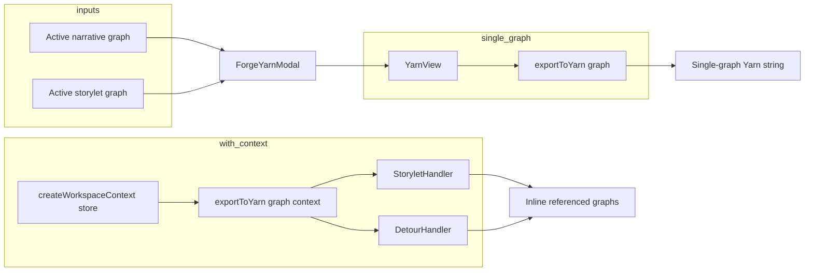

# Dialogue domain and Yarn Spinner

Forge is the visual, node-based dialogue editor. This doc captures narrative vs storylet graphs, node types, storylets/detours, and how Yarn Spinner output is produced. For reimplementation.

## Graph kinds

- **FORGE_GRAPH_KIND.NARRATIVE** — Structure graph: acts, chapters, pages, and calls into storylet graphs (Storylet/Detour nodes).
- **FORGE_GRAPH_KIND.STORYLET** — Dialogue graph: character lines, player choices, conditionals; can nest storylet/detour calls.

Store: `graphs.byId`, `activeNarrativeGraphId`, `activeStoryletGraphId`, breadcrumbs per scope. Subscriptions load narratives and storylets via `adapter.listGraphs(projectId, kind)`.

Draft: one draft per scope; narrative and storylet editors read/write `draftGraph` for the active graph. Commit uses `commitForgeDraftWithAdapter` (createPage for new Act/Chapter/Page, updateGraph for flow/title/startNodeId/endNodeIds/compiledYarn).

## Narrative graph editor

**Nodes:** ACT, CHAPTER, PAGE, CONDITIONAL, DETOUR, STORYLET (plus START → ActNode). No CHARACTER or PLAYER.

**Role:** Structure (acts/chapters/pages) and calls into storylet graphs via Storylet and Detour nodes.

Location: `packages/forge/src/components/ForgeWorkspace/components/GraphEditors/ForgeNarrativeGraphEditor/`.

## Storylet graph editor

**Nodes:** CHARACTER, PLAYER, CONDITIONAL, STORYLET (StoryletNode), DETOUR. No Act/Chapter/Page.

**Role:** Dialogue content and optional nested storylet/detour calls.

Location: `packages/forge/src/components/ForgeWorkspace/components/GraphEditors/ForgeStoryletGraphEditor/`.

## Storylets and detours

**Data model (ForgeStoryletCall):** `mode` (DETOUR_RETURN | JUMP), `targetGraphId`, `targetStartNodeId?`, `returnNodeId?`, `returnGraphId?`. Stored on node as `node.data.storyletCall`. Used by both STORYLET and DETOUR nodes.

- **Storylet (JUMP):** Jump to another graph's start (or targetStartNodeId). No return; flow continues in target graph.
- **Detour (DETOUR_RETURN):** Jump to another graph; when that graph's end nodes are reached, Yarn export redirects to returnNodeId (and optionally returnGraphId). Detour handler inlines the target graph and rewrites end-node jumps to the return node.

**Yarn export:** Storylet and Detour handlers need `YarnConverterContext` with `getGraphFromCache` / `ensureGraph` (from workspace store). They mark targetGraphId in `visitedGraphs` to avoid infinite recursion; fetch target graph; emit current node (next → target start); recursively export target graph's nodes via handler registry and append. Detour also rewrites referenced graph end nodes to jump to returnNodeId.

**Important:** If `exportToYarn(graph)` is called **without** context (e.g. from YarnView), storylet/detour nodes that reference other graphs cannot resolve them; handlers throw or fall back to placeholders. The Yarn modal currently passes a single graph and does not pass `createWorkspaceContext(store)`.

## Yarn compilation pipeline

1. **Single-graph path (current UI):** ForgeYarnModal shows either narrative or storylet graph (by focusedEditor/graphScope). YarnView calls `exportToYarn(graph)` with no context — only one graph is exported; STORYLET/DETOUR refs to other graphs do not resolve.
2. **Multi-graph path (intended):** `exportToYarn(graph, createWorkspaceContext(store))` lets storylet/detour handlers load and inline referenced graphs from store.
3. **Pipeline:** `prepareGraphForYarnExport` (runtime-export.ts) strips runtime-only nodes and builds exportable node list. Main index iterates nodes and delegates to handler registry (character, player, conditional, storylet, detour). Handlers use NodeBlockBuilder / YarnTextBuilder to produce `===`-delimited node blocks.
4. **Composition compiler:** `useForgeWorkspaceCompositionCompiler` is a stub (video composition removed); returns null. Not used for Yarn.

Yarn is compiled **per graph** via `exportToYarn(graph[, context])`. Composition happens only when a graph contains Storylet/Detour nodes and export is run **with** workspace context so those nodes can inline target graphs.

## File inventory (summary)

**ForgeWorkspace root:** ForgeWorkspace.tsx, ForgeDataContext.tsx; layout (ForgeWorkspaceLayout, MenuBar, Panels, Toolbar, ForgeProjectSwitcher, ProjectSync); ForgeSideBar (ForgeNarrativeList, StoryletList, NodePalette, InlineRenameInput, SectionHeader, SectionToolbar); CommandBar; store (forge-workspace-store, slices: graph, draft, gameState, viewState, project, subscriptions); hooks (useForgeWorkspaceActions, useForgeWorkspaceCompositionCompiler, useNodeDrag, usePanelPersistence); utils/forge-workspace-utils (exportDialogueToYarn).

**Graph editors:** ForgeNarrativeGraphEditor, ForgeStoryletGraphEditor + pane context menus; ForgeWorkSpaceModals (ForgeYarnModal, ForgeFlagManagerModal); shared (CommitBar, ForgeEdge, ForgeGraphBreadcrumbs, GraphEditor*, GuidePanel, PaneContextMenu, YarnView, NodeEditor/*, Nodes: Act, Chapter, Page, Character, Player, Conditional, Detour, Storylet + shared components).

**Forge lib:** yarn-converter (index, types, registry, workspace-context; builders; handlers: character, player, conditional, storylet, detour; utils: runtime-export, condition-formatter, condition-parser, content-formatter, variable-handler); graph-editor/hooks; graph-validation; node-editor; utils (constants, forge-flow-helpers, layout).

**Types:** packages/shared/src/types/forge-graph.ts (FORGE_GRAPH_KIND, FORGE_NODE_TYPE, NARRATIVE_FORGE_NODE_TYPE, ForgeGraphDoc, ForgeNode, ForgeStoryletCall, etc.); packages/forge/types re-exports.
