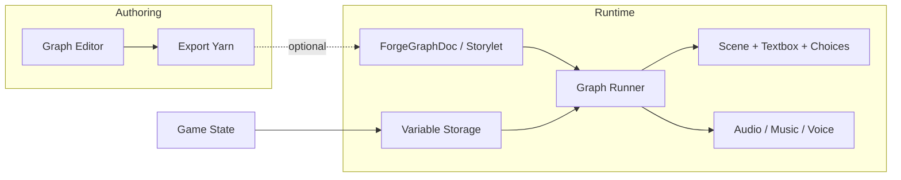

# Plan: Game state and dialogue player (detailed)

Design for game state in the Dialogue editor, a minimal but **interactive** dialogue player (in forge-agent), and the flag/schema overhaul. Prerequisite for a working “play” mode. Dialogue-forge produces graphs and Yarn; this plan defines how they are **played**—with optional character art, audio, and scene behavior—while staying compatible with Yarn Spinner.

---

## Goals

- **Game state in Dialogue Editor:** Use game state (flags; later quests, stats, characters) inside the editor for play mode and for condition evaluation in the player.
- **Interactive player (forge-agent):** A dialogue player that runs through a graph (or equivalent), shows lines and choices, applies `<<set>>`-style updates, and supports **presentation**: character images, backgrounds, textbox, optional audio/music/voice, and simple scene behaviors (e.g. character slides in from left).
- **Yarn Spinner support:** Content authored in dialogue-forge exports to valid Yarn; variable semantics (get/set, conditions) match Yarn. Our player executes graphs directly (no Yarn VM/WASM); export remains for portability.
- **Game flags = RPG state:** Quests, stats, characters map to Yarn Spinner variables, `<<set>>`, and conditions. We use the term **game flags** (not “feature flags” or generic “flags”) in the editor and schema to avoid confusion with engineering feature flags. At runtime the player uses a **variable storage** interface compatible with Yarn.

---

## Architecture: graph-first vs Yarn VM

We need to **associate character images, audio, and scene behavior at specific nodes**. That implies one of:

- **A. Yarn VM + view layer:** Run a Yarn VM; it emits “line”, “options”, “command”. A view layer maps those events to presentation (e.g. by line text or node title). Problem: Yarn export often loses node IDs or merges content; mapping “which character/portrait/audio for this line” is fragile and lossy.
- **B. Graph-first (direct) execution:** Traverse **ForgeGraphDoc** (or storylet subgraph) directly. At each node we have **node id, characterId, content, choices, conditions, setFlags, presentation (imageId, backgroundId, portraitId), runtimeDirectives**. We evaluate conditions against a **variable storage** (same types as Yarn: bool/number/string), apply setFlags to that storage, and advance. Presentation (character slide-in, portrait, voice, music) is driven by node data and optional project-level config (e.g. “character A → this image/voice”).

**Recommendation: B (graph-first).**  
Reuse the existing **execution-strategy** conclusion in dialogue-forge: Option B (direct execution) for MVP gives full control and supports per-node presentation without a fragile event→node mapping. We **export to Yarn** for portability and editor compatibility; playback uses the graph (or a graph-shaped structure produced from Yarn import if we ever run imported Yarn in forge-agent). Variable storage and condition semantics stay Yarn-compatible so we can document and, later, swap in a Yarn VM for “plain Yarn” games if desired.

---

## Tech stack

- **Player:** Web-first (browser). No game engine required for the “standard look” of our Yarn games: textbox, choices, character portraits, simple enter/exit.
- **Rendering:** DOM + CSS (or React) for MVP. Character “slide in from left” and basic transitions are CSS/JS. No dependency on Unity/Godot/Unreal for the player.
- **Optional later:** A web game framework (e.g. Phaser, PixiJS) or a visual-novel–style engine for richer animations, effects, and export targets (e.g. packaged web or desktop). Not required for Phase 1; the plan keeps layout and behaviors documented so a future engine can implement the same flow.
- **Yarn Spinner:** We support it by (1) exporting valid Yarn from dialogue-forge, (2) using the same variable types and condition/set semantics in our runner, and (3) documenting the mapping. See [Yarn Spinner compatibility](#yarn-spinner-compatibility) and [Runtime: direct graph execution (no WASM)](#runtime-direct-graph-execution-no-wasm) below.

---

## Runtime: direct graph execution (no WASM)

**Decision:** Playback uses a **graph runner** that traverses ForgeGraphDoc (or storylet) and evaluates conditions and setFlags against variable storage. We do **not** run Yarn Spinner in WASM or any Yarn VM in the player.

**Why:**

1. **Presentation:** We need per-node presentation (characterId, presentation.backgroundId/portraitId, runtimeDirectives). A Yarn VM only emits line/options/commands; mapping those back to our node IDs and metadata is lossy and fragile.
2. **Simplicity:** One execution path (graph runner), one stack, no WASM build or JS VM dependency.
3. **Yarn compatibility:** We still export valid Yarn and match variable/condition semantics; the content is Yarn-compatible—we just don’t run the Yarn VM ourselves.

---

## MVP scope: game player and presentation

What the MVP includes so implementers know the target.

**In scope:**

- **Variable storage:** get/set, init from flattened game state (including stats and 0 values; see [Handling stats and flattening](51-flag-manager-and-flattening.md)).
- **Graph runner:** Traverse graph, evaluate conditions (all current operators), apply setFlags (set to value; default true for boolean), emit events: EnterNode, Line, Choices, SetVariables, WaitForUser, End.
- **Scene:** Background (from presentation or BACKGROUND directive), character slots (e.g. left/center/right), apply directives on node enter with order (background → portrait → audio).
- **Textbox:** Show speaker + content; wait for advance (click or key).
- **Choices:** Show list of choices (condition-filtered); on select, apply setFlags and go to nextNodeId.
- **Presentation events:** Runner emits node id, characterId, content, presentation (backgroundId, portraitId), runtimeDirectives so the view can update background, portraits, and optional audio.
- **Optional but MVP-documented:** Character enter animation (e.g. slide in), portrait in slot, music/voice hooks (AUDIO_CUE). Implementation can be minimal (e.g. CSS transition, one music track) but the **contract** (when to trigger, what payload) is part of MVP.

**Tech stack (confirmed):** Web (browser). DOM + CSS or React. No game engine, no WASM. Optional later: Phaser/PixiJS or VN-style engine for richer effects; not required for MVP.

---

## Naming: game flags vs variables

In the **editor and schema** we use **flag manager**, **flag schema**, and **game flags** (with `FLAG_TYPE`: QUEST, STAT, DIALOGUE, ITEM, ACHIEVEMENT, TITLE, GLOBAL). We call them **game flags** to avoid confusion with feature flags and other engineering flag terms. The flag manager defines categories, value types, and optional links for each game flag.

At **runtime** the player uses a **variable storage** (Yarn-compatible): get/set by variable name. Game state (including game flags and stats) is flattened into this single variable namespace when initializing the player. So: game flags in authoring → variables in execution.

---

## Game state and variable storage

### In dialogue-forge

- **Types:** [packages/shared/.../forge-game-state.ts](../../packages/shared/src/types/forge-game-state.ts): `ForgeGameState` (flags + optional characters), `ForgeFlagState` (flat key → bool/number/string).
- **Flattener:** [packages/forge/.../game-state-flattener.ts](../../packages/forge/src/lib/game-player/game-state-flattener.ts): flattens nested game state to Yarn-compatible flat variables for condition eval and set.
- **Store:** [packages/forge/.../gameState.slice.ts](../../packages/forge/src/components/ForgeWorkspace/store/slices/gameState.slice.ts): `activeGameState`, `activeFlagSchema`, load/set state.

### In the player (forge-agent)

- **Variable storage interface (Yarn-compatible):** The runner does not depend on ForgeGameState directly. It depends on a small interface:
  - `get(name: string): boolean | number | string | undefined`
  - `set(name: string, value: boolean | number | string): void`
  - Optional: `getSnapshot()` for persistence / debugging.
- **Initialization:** Player receives “initial game state” (e.g. from editor or saved slot). That state is flattened (same rules as dialogue-forge flattener) into the variable storage. Flag schema can be used for validation or UI (e.g. which variables exist) but is not required for execution.
- **During play:** Conditions are evaluated by reading from this storage (see Condition evaluation below). setFlags and choice-level setFlags write into it. So “game state” in the player is exactly this variable store; dialogue-forge’s `ForgeGameState` is the authoring/save format that flattens into it.

### Condition evaluation

- **Operators:** Same as Yarn and dialogue-forge: IS_SET, IS_NOT_SET, EQUALS, NOT_EQUALS, GREATER_THAN, LESS_THAN, etc. (see [packages/shared/.../constants.ts](../../packages/shared/src/types/constants.ts) and condition types in [forge-graph](../../packages/shared/src/types/forge-graph.ts)).
- **Types:** Values in storage are boolean | number | string. Conditions compare flag value to a literal (or check set/unset).
- **Graph runner:** For CONDITIONAL nodes, evaluate blocks in order (if → elseif → else); first matching block wins. For PLAYER nodes, filter choices by their conditions. For CHARACTER nodes with conditionalBlocks, same if/elseif/else evaluation to pick content and nextNodeId.

### setFlags / <<set>> semantics

- **Character/conditional/player nodes:** Each can have `setFlags: string[]`. Runner applies these when the node (or the chosen block/choice) is executed. Semantics: set each flag to a value. Default is “true” (boolean) unless we extend with explicit value (e.g. from a future flag schema: “quest_stage” → number). For Yarn parity, we support at least boolean set; number/string can be added via schema or conventions.
- **Yarn mapping:** Our setFlags become `<<set $name to value>>` in export. In the player, applying setFlags calls `variableStorage.set(name, value)`.

---

## Player components (forge-agent)

### 1. Variable storage

- **Interface:** `get(name)`, `set(name, value)`; values are boolean | number | string.
- **Implementation:** In-memory object for MVP; can be backed by persistence (e.g. save slot) or sync with a game engine later.
- **Initialization:** From initial game state (flattened) plus any defaults from flag schema.

### 2. Graph runner (engine)

- **Input:** Graph (ForgeGraphDoc or equivalent), start node id, variable storage.
- **Responsibilities:**
  - Resolve current node by id.
  - Dispatch by node type: CHARACTER, PLAYER, CONDITIONAL, STORYLET, DETOUR, etc.
  - For CHARACTER: optional conditional blocks → pick block by condition, show content, apply block setFlags, follow nextNodeId or defaultNextNodeId.
  - For PLAYER: filter choices by conditions, present options; on choice, apply choice setFlags, go to choice nextNodeId.
  - For CONDITIONAL: same block evaluation; no “line” to show unless a block has content; apply setFlags and follow nextNodeId.
  - For STORYLET/DETOUR: resolve target graph and start node; run subgraph (stack or replace); return/continue as per mode.
- **Output:** Stream of “presentation events”: Line(nodeId, characterId, content, presentation?), Choices(nodeId, choices[]), SetVariables(...), WaitForUser(), etc. The view layer subscribes to these and drives scene/textbox/audio.

### 3. Scene / layout

- **Purpose:** One “scene” per running graph (or subgraph). Contains: background, character slots, textbox, choice list.
- **Character slots:** e.g. left, center, right (or a small set of positions). Each slot can show a character image/portrait (from node `presentation.portraitId` or project config keyed by `characterId`).
- **Behaviors (documented for implementation):**
  - **On scene start:** Optional background image/music (from graph or first node presentation/config).
  - **On entering a line (CHARACTER or conditional block with content):** Optional “character enter” (e.g. slide from left into a slot); show speaker name + text in textbox; optional portrait in slot; optional voice clip. Then WaitForUser (advance on click or key).
  - **Two characters in scene:** Two slots can be filled (e.g. left + right). Graph continues through nodes; each node can specify which character speaks. No hard limit on “two”; layout can support 2 for MVP and extend.
  - **On choices (PLAYER):** Show choice buttons; on select, runner applies setFlags and transitions to next node; optionally animate (e.g. textbox hides, next line appears).

### 4. Textbox

- **Content:** Speaker name (from characterId → display name or node speaker), dialogue text (content).
- **Behavior:** Show line; wait for user advance (click or key); then emit “continued” so runner can move to next node or same-node next block.

### 5. Choices

- **Content:** List of { text, optional conditions (already evaluated by runner) }. Only choices that pass conditions are shown.
- **Behavior:** User clicks a choice; runner applies that choice’s setFlags and navigates to nextNodeId; scene updates (e.g. next line or new character).

### 6. Audio (optional hooks)

- **Music:** Trigger by scene or by node (e.g. runtimeDirectives or presentation). Start/stop/transition.
- **Ambient:** Same idea.
- **Character voice:** Per line (node + characterId) or per character; hook from “Line” event so the view can play a clip.

Not required for MVP; the layout and runner should emit events so audio can be plugged in without changing the core loop.

---

## Scene management (MVP)

When and how presentation and directives apply. Types: [packages/shared/src/types/runtime.ts](../../packages/shared/src/types/runtime.ts) (`RUNTIME_DIRECTIVE_TYPE`: SCENE, MEDIA, CAMERA, BACKGROUND, PORTRAIT, OVERLAY, AUDIO_CUE; `RUNTIME_DIRECTIVE_APPLY_MODE`: ON_ENTER, PERSIST_UNTIL_CHANGED) and [packages/shared/src/types/forge-graph.ts](../../packages/shared/src/types/forge-graph.ts) (`ForgeNodePresentation`: imageId, backgroundId, portraitId; `ForgeRuntimeDirective`). Yarn export strips these; the player reads them from the graph.

- **When does the background change?** When the runner **enters a node** that has (a) `presentation.backgroundId` or (b) a `runtimeDirectives` entry with `type: BACKGROUND` (and optional refId/payload). The scene layer subscribes to runner events; on EnterNode or Line it receives the current node’s presentation + directives and applies the background. So: **background changes on node enter** when that node (or its directives) specify a different background.
- **When does music play or stop?** When the runner emits a directive of type `AUDIO_CUE`. Minimal payload shape for MVP: `payload: { kind: 'music' | 'ambient' | 'voice', url?: string, action: 'play' | 'stop' | 'fadeOut' }`. **Play:** on directive with action play (and optional url). **Stop:** on directive with action stop or fadeOut, or when the scene ends (runner ended). `PERSIST_UNTIL_CHANGED` means “keep this music until another AUDIO_CUE for the same kind overwrites it.”
- **Text presentation:** Driven by Line events: show speaker + content, wait for advance (click/key), then runner continues.
- **Order of application:** On node enter, the runner (or scene manager) applies in a defined order, e.g.: (1) BACKGROUND / backgroundId, (2) PORTRAIT / portraitId per character slot, (3) AUDIO_CUE. This avoids ambiguity (e.g. background before characters so they render on top).

---

## Layout and behaviors (canonical description)

These behaviors define what “a Yarn game exported from our system” does. Implementations (DOM, React, or a future game engine) should follow them so that the same graph plays the same way.

1. **Fresh scene**
   - Load graph + start node id; initialize variable storage from initial game state (flattened).
   - Optionally set background and music from graph or first node.
   - Runner moves to start node and emits first event (e.g. Line or Choices).

2. **Character enters**
   - When a line is shown for a character not yet in the scene, “character enter” runs (e.g. slide from left into a slot). Duration and easing are implementation-defined (CSS or engine).
   - If the same character speaks again, no re-enter; portrait/text can update in place.

3. **Line (dialogue)**
   - Show speaker name + content in textbox; optionally show portrait in the character’s slot.
   - Optional: play character voice clip (keyed by characterId or node).
   - Wait for user to advance (click or key); then runner advances (next node or next block).

4. **Two (or more) characters**
   - Multiple slots; each line targets a character (characterId). Runner emits who is speaking; view assigns to slot. Graph continues through nodes; no special “two-character node”—just consecutive nodes with different characterIds.

5. **Choices**
   - Runner evaluates conditions for each choice; only pass choices are emitted. View shows them as buttons (or list).
   - On select: apply that choice’s setFlags to variable storage; go to choice’s nextNodeId; optionally animate transition (e.g. textbox clear, then next line).

6. **Conditional node**
   - No visible “line” unless a block has content. Runner evaluates blocks in order; first match: apply block setFlags, follow block nextNodeId; if block has content, emit Line and wait for advance, then continue.

7. **End of graph**
   - When nextNodeId is missing or node type is END, runner ends. View can show “The End” or return to menu; variable storage can be persisted as “save” for that run.

---

## Yarn Spinner compatibility

We **execute graphs directly** (see [Runtime: direct graph execution (no WASM)](#runtime-direct-graph-execution-no-wasm)); we do not run the Yarn VM or WASM. Our **export** produces valid Yarn; our **runner** uses the same variable types and condition/set semantics so that (a) exported Yarn could be run in other tools, and (b) our runner behavior matches what Yarn would do for the same variables and conditions.

- **Export:** dialogue-forge exports to Yarn via [packages/forge/.../yarn-converter](../../packages/forge/src/lib/yarn-converter/index.ts). Export remains the compatibility contract for “this content is valid Yarn.”
- **Variables:** Variable storage holds the same types as Yarn (bool, number, string). Flattening rules (dialogue-forge) produce the same keys we’d get from Yarn `<<set $x>>` and declarations.
- **Conditions:** Our condition model (flag, operator, value) maps to Yarn `<<if>>` / `<<elseif>>`; we evaluate the same way so behavior matches.
- **Runtime:** We do not run a Yarn VM or WASM; our player executes graphs directly. Variable storage and condition semantics are documented so external Yarn tools or a future VM could consume our exports if ever needed.

**Yarn Spinner references:**

- [Yarn Spinner documentation](https://docs.yarnspinner.dev/) — syntax, variables, `<<set>>`, conditions, storylets/saliency.
- [YarnSpinnerTool/YarnSpinner](https://github.com/YarnSpinnerTool/YarnSpinner) — variable storage interface expectation (C# runtime; we mirror variable/condition behavior).
- Optional: storylets/saliency primer so authors know our graphs and variables align with Yarn’s model (when clauses, interpolation where relevant).

---

## Flag and schema manager (dialogue-forge)

We call this the **flag manager**; it manages **game flags** (not feature flags). It defines and validates all narrative game state variables: quest state, simple dialogue flags (that never escape the dialogue and set on our game state), stats that can be updated (e.g. gold, reputation), items, achievements, titles, and global state. It’s a narrative game—the schema defines categories and value types for each.

- **Overhaul in dialogue-forge first.** The flag/schema manager in this repo must be fully overhauled (data model, UI, persistence, validation) before being introduced into forge-agent. Forge-agent will **not** get the current flag/schema manager as-is.
- **Responsibilities:** Define categories, game flag types (dialogue, quest, stat, item, achievement, title, global), value types (boolean, number, string); optional link to quests/stats/characters. Schema is used by the editor (condition UI, setFlags UI) and can inform the player (e.g. which variables to show in a debug panel or save format). Overhaul is a prerequisite for a reliable play mode and for conditionals/setFlags in the editor.
- **Stats and flattening:** For how stats and other flag types flatten into variable storage, and how complex we can get while staying maintainable, see [Handling stats and flattening](51-flag-manager-and-flattening.md).

---

## Current dialogue-forge pieces (reference)

| Piece | Location | Role |
|------|----------|------|
| Game state slice | [gameState.slice.ts](../../packages/forge/src/components/ForgeWorkspace/store/slices/gameState.slice.ts) | activeGameState, activeFlagSchema, load/set |
| Types | [forge-game-state.ts](../../packages/shared/src/types/forge-game-state.ts) | ForgeGameState, ForgeFlagState, ForgeGameStateRecord |
| Flattener | [game-state-flattener.ts](../../packages/forge/src/lib/game-player/game-state-flattener.ts) | Flatten to Yarn-compatible variables |
| Execution strategy | [execution-strategy.md](../../packages/forge/src/lib/game-player/docs/execution-strategy.md) | Option B (direct) recommended for MVP |
| Graph types | [forge-graph.ts](../../packages/shared/src/types/forge-graph.ts) | ForgeNode (characterId, content, choices, conditionalBlocks, setFlags, presentation, runtimeDirectives) |
| Yarn export | [yarn-converter](../../packages/forge/src/lib/yarn-converter/index.ts) | exportToYarn, importFromYarn |

The current game player in dialogue-forge **never worked fully**. The basic player is to be implemented in forge-agent per this plan, not ported as-is.

---

## Game player planning and Yarn runtime directives

**Significant planning is needed for the game player** (presentation and interactivity) as a separate effort from export. Yarn Spinner has runtime directives and concepts (e.g. line metadata, presenters, behavior) that describe how content is presented; we should **investigate** which of these map to our graph-first player. They may be too rigid for our model; explore further. Document as a planning dependency; see [54-migration-roadmap.md](54-migration-roadmap.md) Phase 5 and [52-yarn-spinner-variables-flattening-caveats.md](52-yarn-spinner-variables-flattening-caveats.md) (Game player and Yarn runtime directives).

---

## Done

- (None yet.)

---

## Next

1. **Overhaul flag/schema manager** in dialogue-forge (data model, UI, persistence, validation).
2. **Implement variable storage interface** in forge-agent (get/set, init from flattened game state).
3. **Implement graph runner** in forge-agent (traverse ForgeGraphDoc, evaluate conditions, apply setFlags, emit presentation events).
4. **Implement scene + textbox + choices** in forge-agent (layout and behaviors as above; standard look for “Yarn games” from our system).
5. **Add optional character/audio hooks** (character enter, portrait, music/voice) driven by node presentation or config.
6. **Wire game state into Dialogue editor** for play mode (editor passes initial game state + graph to player; document flow).
7. **Document** variable storage contract and condition/set semantics so a future Yarn VM could replace the graph runner for plain-Yarn playback if needed.
8. **Third-party Yarn:** If we ever need to run third-party Yarn files without our graph format, we could evaluate a Yarn VM; for our own exports, graph-first is sufficient and we are not pursuing WASM for the game player.
