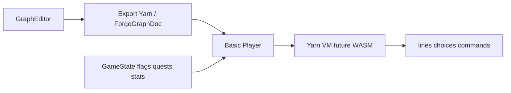

# Plan: Game state and basic player

Design for game state in the Dialogue editor, a minimal dialogue player in forge-agent, and the flag/schema overhaul. Prerequisite for a working “play” mode.

## Goals

- **Game state in Dialogue Editor:** Use game state (flags; later quests, stats, characters) inside the editor for a very basic “play” mode.
- **Basic player (forge-agent):** A minimal dialogue player that can play through a graph (show lines, choices, apply `<<set>>` commands). Implemented in the new codebase; consumes graphs and Yarn export from the migrated editor and a clear game-state API (after flag/schema overhaul).
- **Flags = RPG state:** Quests, stats, characters map to Yarn Spinner variables, `<<set>>`, and conditions. Our types keep the “flags” naming; the plan documents the mapping to Yarn variables.

## Current dialogue-forge pieces

- **gameState slice** ([packages/forge/.../gameState.slice.ts](../../packages/forge/src/components/ForgeWorkspace/store/slices/gameState.slice.ts)): `ForgeGameState`, `activeGameState`, `activeFlagSchema`, load/set state.
- **Types** ([packages/shared/.../forge-game-state.ts](../../packages/shared/src/types/forge-game-state.ts)): `ForgeGameState` (flags + optional characters), `ForgeFlagState`, `ForgeGameStateRecord`.
- **Flattener** ([packages/forge/.../game-state-flattener.ts](../../packages/forge/src/lib/game-player/game-state-flattener.ts)): flattens state to Yarn-compatible variables.

The current game player in dialogue-forge **never worked fully**. The basic player is to be implemented in forge-agent, not ported as-is.

## Intended flow (design only)

1. **Editor:** Gets “current game state” from store or from a play session; passes it into the future player. Conditionals and setFlags read/write this state.
2. **Player:** Receives graph (or Yarn export) + initial game state; runs through nodes; emits lines, options, commands; applies `<<set>>` to state.
3. **State ↔ Yarn:** Keep our state model (flags/quests/stats/characters) in sync with Yarn variables via the flattener or equivalent. “Build our graphs right” means: export Yarn that matches what the engine expects.

## Flag and schema manager

- **Overhaul in dialogue-forge first.** The flag/schema manager in this repo must be fully overhauled (data model, UI, persistence, validation) before being introduced into forge-agent.
- Forge-agent will **not** get the current flag/schema manager as-is.
- **Intended responsibilities:** Define categories, flag types, value types; optional link to quests/stats/characters. Overhaul is a prerequisite for a working player and for conditionals/setFlags in play mode.

## Yarn Spinner engine: WASM option

- **Idea:** Run the Yarn Spinner engine in the browser via WASM and build our player on top of it.
- **Options to document:** (1) WASM in browser + our player UI/state layer; (2) reimplement a minimal runner; (3) use their Unity/other runtime and keep play in a separate build.
- **Reference:** [YarnSpinnerTool/YarnSpinner](https://github.com/YarnSpinnerTool/YarnSpinner) for compiler/output format and runtime expectations.
- No commitment to WASM in Phase 1; this is a “consider and document” item so the basic player design stays compatible with a future WASM-based engine.

## Done

- (None yet.)

## Next

1. Overhaul flag/schema manager in dialogue-forge (data model, UI, persistence, validation).
2. Design and implement basic player in forge-agent (consume Yarn/graph + game state API).
3. Wire game state into Dialogue editor for play mode; document flow in forge-agent.
4. Evaluate WASM vs minimal runner when implementing the player runtime.
