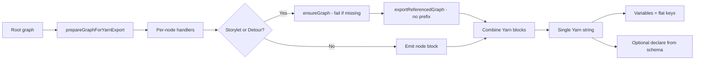

# Forge migration roadmap

Single place for **ordered migration work** and **pointers to technical context**. Use this when rebuilding in the other codebase. Decisions and caveats are in [52-yarn-spinner-variables-flattening-caveats.md](52-yarn-spinner-variables-flattening-caveats.md) and linked docs.

---

## Purpose

- Order work into phases so types, contracts, export pipeline, editor, and tests are built in a sensible sequence.
- Link each phase to the docs and code paths needed to implement it.
- Surface decisions and known issues in one place.

---

## Export to Yarn (high-level flow)

---

## Phase 1 — Types and contracts

**Outcome:** Graph types, game state shape, and variable/Yarn contract are defined and documented so export and runner can rely on them.

**Technical context:**

- [30-plan-yarn-and-graph-types.md](30-plan-yarn-and-graph-types.md) — ForgeGraphDoc, ForgeNode, node types (PAGE, STORYLET, DETOUR, etc.).
- [50-game-state-and-player.md](50-game-state-and-player.md) — Game state, variable storage, graph runner (no WASM).
- [51-flag-manager-and-flattening.md](51-flag-manager-and-flattening.md) — ForgeGameState shape, flattening rules, stats and zero, complex examples.
- [52-yarn-spinner-variables-flattening-caveats.md](52-yarn-spinner-variables-flattening-caveats.md) — Why we flatten, variable names in graph, declarations, decisions table.
- Code: [packages/shared/src/types/forge-game-state.ts](../../packages/shared/src/types/forge-game-state.ts), [packages/shared/src/types/forge-graph.ts](../../packages/shared/src/types/forge-graph.ts), [packages/forge/src/lib/game-player/game-state-flattener.ts](../../packages/forge/src/lib/game-player/game-state-flattener.ts).

**Decisions / caveats:**

- One flat variable namespace; flatten with separator (default `_`). Stats can be 0: implement `includeFalsyNumbers`. Variable names in Yarn = flattened keys; graph should store flat key or map schema id at export/runner per 51. Optional `<<declare>>` when schema available at export.

---

## Phase 2 — Yarn export pipeline

**Outcome:** `exportToYarn(graph, context)` produces a single Yarn string; storylet/detour resolve via context; missing graph fails export and warns. **Full export is server-side** (see [55](55-data-access-and-export.md)); client can show preview without full resolution.

**Technical context:**

- [12-yarn-spinner-alignment.md](12-yarn-spinner-alignment.md) — Node types to Yarn, export pipeline steps.
- [30-plan-yarn-and-graph-types.md](30-plan-yarn-and-graph-types.md) — Port steps for yarn-converter.
- [52-yarn-spinner-variables-flattening-caveats.md](52-yarn-spinner-variables-flattening-caveats.md) — Inlining (no prefix), missing graph (fail + warn), narrative skeleton.
- [53-forge-yarn-export-goal-next-steps.md](53-forge-yarn-export-goal-next-steps.md) — Goal, next steps, server-side export.
- [55-data-access-and-export.md](55-data-access-and-export.md) — Data access, server-side export resolution.
- Code: [packages/forge/src/lib/yarn-converter/](../../packages/forge/src/lib/yarn-converter/) — index.ts, handlers, workspace-context.ts, utils/runtime-export.ts, utils/variable-handler.ts.

**Decisions / caveats:**

- No prefix when inlining; use node ids as stored. **Enforce unique node ids in the editor** (graph-scoped or global) so duplicate titles cannot occur when inlining. If referenced graph does not load, fail the whole export and warn the user. Full Yarn export with resolution is **server-side**. Cycle detection via `visitedGraphs` (see Known issues / Graph ids).

---

## Phase 3 — Nodes and editor

**Outcome:** ForgeWorkspace, node components, inspector, graph list; export preview from client; **data access via React Query hooks + Payload CMS SDK** (no data adapters). Graph CRUD uses hooks (e.g. `useForgeGraph(id)`, `useForgeGraphs(projectId, kind)`, `useCreateForgeGraph()`, `useUpdateForgeGraph()`). Full export is server-side (see 55).

**Technical context:**

- [31-plan-nodes-and-inspector.md](31-plan-nodes-and-inspector.md) — Node components, inspector, no Writer link; graph list via hooks.
- [33-plan-dialogue-editor-chrome.md](33-plan-dialogue-editor-chrome.md) — ForgeWorkspace chrome.
- [55-data-access-and-export.md](55-data-access-and-export.md) — React Query + Payload, no adapters; server-side export.
- [README-FORGE-FOCUS.md](README-FORGE-FOCUS.md) — Scope, goal, codebase anchors.
- Code: ForgeWorkspace store, graph list (from hooks), breadcrumbs; node types and inspector sections.

**Decisions / caveats:**

- **No data adapters.** Use React Query hooks that call Payload CMS SDK. Act, Chapter, Page are all page nodes; linking via page node; user selects from project pages. Export contract uses PAGE only (and narrative Detour/Jump). See 12. **Variable suggestion system** (52): low-code-style suggestions for variables/conditions; significant planning. **Game player** (50): presentation and interactivity need separate planning; Yarn runtime directives to investigate.

---

## Phase 4 — Variables and declarations

**Outcome:** Flattener supports `includeFalsyNumbers`; variable names in graph align with flat keys (or mapping documented); optional `<<declare>>` block **only when export context includes a schema**. **Extend setFlags** to support `SetFlagOp[]` with `{ id, value }` (explicit value per flag); wire through handlers and variable-handler.

**Technical context:**

- [51-flag-manager-and-flattening.md](51-flag-manager-and-flattening.md) — Flattening rules, stats and zero, boolean false, setFlags shape extension.
- [52-yarn-spinner-variables-flattening-caveats.md](52-yarn-spinner-variables-flattening-caveats.md) — Declarations (only with schema), variable names in graph, setFlags row, variable suggestion system.
- Code: [packages/forge/src/lib/game-player/game-state-flattener.ts](../../packages/forge/src/lib/game-player/game-state-flattener.ts), [packages/forge/src/lib/yarn-converter/utils/variable-handler.ts](../../packages/forge/src/lib/yarn-converter/utils/variable-handler.ts) (formatSetCommand, extend for SetFlagOp).

**Decisions / caveats:**

- Prefer storing flat key in graph; if schema id, map at export and runner per flattener path rules. Emit `<<declare>>` only when schema in export context. setFlags: support `{ id, value }[]`; export emits `<<set $flatKey = value>>` per op. Variable suggestion system is a requirement (52); game player planning is future work (50).

---

## Phase 5 — Validation and tests

**Outcome:** E2E "complete Yarn" test (root + referenced graphs, server-side); import round-trip where applicable. **Game player:** Significant planning for presentation and interactivity; align with Yarn runtime directives where useful (investigate).

**Technical context:**

- [53-forge-yarn-export-goal-next-steps.md](53-forge-yarn-export-goal-next-steps.md) — Next steps 5–8.
- [52-yarn-spinner-variables-flattening-caveats.md](52-yarn-spinner-variables-flattening-caveats.md) — No prefix; uniqueness enforced in editor so duplicates cannot occur.
- [50-game-state-and-player.md](50-game-state-and-player.md) — Game player planning, Yarn runtime directives.

**Decisions / caveats:**

- Unique node ids are enforced in the editor (graph-scoped or global), so inlined export does not produce duplicate Yarn titles. Game player (presentation, interactivity) and Yarn runtime directives need separate planning; see 50.

---

## Known issues and graph ids

- **Graph ids (Payload):** In a **Payload-backed** forge-agent app, graph documents use Payload document ids, which are **numeric**. Use **number** for graph id everywhere (e.g. `id: number` in hooks, `Set<number>` for `visitedGraphs`). Ensure storylet/detour `targetGraphId` and context APIs (`getGraphFromCache`, `ensureGraph`) use the same type so cycle detection and cache keys are consistent. In dialogue-forge, graphId may be string in some places; when porting to forge-agent, standardize on **number** when using Payload.
- **visitedGraphs:** If the backend is Payload, graph ids are numbers—so `visitedGraphs: Set<number>` is correct. Pass numeric graph id consistently in storylet/detour handlers and workspace context.

---

## Doc index (quick links)

| Doc | Content |
|-----|---------|
| [00-index](00-index.md) | Entry point, document list, forge focus |
| [12](12-yarn-spinner-alignment.md) | Node types to Yarn, export/import pipeline, PAGE only in contract |
| [30](30-plan-yarn-and-graph-types.md) | Graph types, yarn-converter port steps |
| [31](31-plan-nodes-and-inspector.md) | Nodes and inspector |
| [33](33-plan-dialogue-editor-chrome.md) | ForgeWorkspace chrome |
| [50](50-game-state-and-player.md) | Game state, variable storage, runner, no WASM |
| [51](51-flag-manager-and-flattening.md) | Game flags, flattening, stats and zero |
| [52](52-yarn-spinner-variables-flattening-caveats.md) | Why flatten, declarations, variable names, caveats, decisions |
| [53](53-forge-yarn-export-goal-next-steps.md) | Goal, next steps, server-side export, resolved/remaining questions |
| [55](55-data-access-and-export.md) | Data access (React Query, Payload), server-side export resolution |
