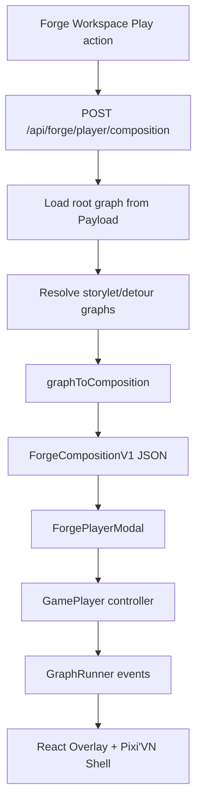

# 67 - Pixi'VN Composition Contract and Graph Adapter

## Purpose

This document is the canonical implementation guide for the first Pixi'VN player slice in `dialogue-forge`.

It locks:

1. **Engine package**: `@drincs/pixi-vn` (plus `pixi.js` runtime surface).
2. **Execution model**: graph-first runner (no Yarn VM/WASM).
3. **Composition contract**: `ForgeCompositionV1` in shared types.
4. **Delivery model**: server composition generated on demand.
5. **Frame-cycle runtime**: deferred (schema hooks present now).

## Implemented in this slice

- Shared composition contract: `packages/shared/src/types/composition.ts`.
- Graph runner + variable storage:
  - `packages/forge/src/lib/game-player/variable-storage.ts`
  - `packages/forge/src/lib/game-player/runner-events.ts`
  - `packages/forge/src/lib/game-player/graph-runner.ts`
- Graph -> composition adapter:
  - `packages/forge/src/lib/game-player/composition/graph-to-composition.ts`
  - `packages/forge/src/lib/game-player/composition/storylet-detour-resolver.ts`
- Forge player surface:
  - `packages/forge/src/components/GamePlayer/GamePlayer.tsx`
  - `packages/forge/src/components/GamePlayer/PixiVNPlayerShell.tsx`
  - `packages/forge/src/components/GamePlayer/GamePlayerOverlay.tsx`
  - `packages/forge/src/components/GamePlayer/useGamePlayerController.ts`
- Studio composition API:
  - `apps/studio/app/api/forge/player/composition/route.ts`
- Forge workspace integration:
  - `packages/forge/src/components/ForgeWorkspace/ForgeWorkspace.tsx`
  - `packages/forge/src/components/ForgeWorkspace/components/ForgeWorkspaceMenuBar.tsx`
  - `packages/forge/src/components/ForgeWorkspace/components/GraphEditors/ForgeWorkSpaceModals/ForgePlayerModal.tsx`

## Composition contract (`ForgeCompositionV1`)

Canonical shared type:
- `schema`: `forge.composition.v1`
- `rootGraphId`
- `entry`: graph + node start point
- `resolvedGraphIds`
- `graphs`: normalized graph snapshots used by player/runtime
- `scenes`, `tracks`, `cues`
- `characterBindings`, `backgroundBindings`
- `diagnostics`

### Why this contract

- Stable transport format between Forge and player.
- Reusable for future timeline/editor integration.
- Keeps player runtime decoupled from Payload document shapes.
- Supports strict diagnostics for unresolved references.

## Graph -> composition mapping

| Forge data | Composition target |
|---|---|
| `ForgeGraphDoc` | `CompositionGraph` |
| `flow.nodes[].id` | `CompositionGraph.nodeOrder[]` + `nodesById[id]` |
| `node.data.content` | `LINE` cue `text` |
| `node.data.choices` | `CHOICES` cue `choices[]` |
| `node.data.setFlags` | `SET_VARIABLES` cue entries |
| `node.data.presentation.*` | `DIRECTIVE` cues + bindings |
| `node.data.storyletCall.targetGraphId` | resolver expansion into `resolvedGraphIds` |

## Runtime flow



## API contract

Route:
- `POST /api/forge/player/composition`

Request:

```json
{
  "rootGraphId": 101,
  "gameState": {
    "flags": {
      "quest_started": true,
      "player_gold": 0
    }
  },
  "options": {
    "resolveStorylets": true
  }
}
```

Success response:

```json
{
  "ok": true,
  "rootGraphId": 101,
  "composition": {
    "schema": "forge.composition.v1",
    "rootGraphId": 101,
    "entry": { "graphId": 101, "nodeId": "start" },
    "resolvedGraphIds": [101, 205],
    "generatedAt": "2026-02-09T00:00:00.000Z",
    "graphs": [],
    "scenes": [],
    "tracks": [],
    "cues": [],
    "characterBindings": [],
    "backgroundBindings": [],
    "diagnostics": []
  },
  "resolvedGraphIds": [101, 205],
  "diagnostics": []
}
```

Error response:

```json
{
  "ok": false,
  "code": "MISSING_REFERENCED_GRAPH",
  "message": "Referenced graph 205 could not be resolved"
}
```

## Code examples

### 1. Build composition from a graph (package-level)

```ts
import { graphToComposition } from '@magicborn/forge';

const result = await graphToComposition(rootGraph, {
  resolveStorylets: true,
  resolver: async (graphId) => loadGraphById(graphId),
  failOnMissingGraph: true,
});

console.log(result.composition.schema); // forge.composition.v1
```

### 2. Create a runner with flattened game state preserving zeros

```ts
import { createGraphRunner } from '@magicborn/forge';

const runner = createGraphRunner({
  rootGraph,
  initialGameState: {
    flags: { player_gold: 0, quest_started: true },
  },
});

const firstEvents = runner.step();
```

### 3. Studio callback used by Forge workspace

```ts
const requestPlayerComposition = async (rootGraphId: number) => {
  const response = await fetch('/api/forge/player/composition', {
    method: 'POST',
    headers: { 'Content-Type': 'application/json' },
    body: JSON.stringify({
      rootGraphId,
      options: { resolveStorylets: true },
    }),
  });
  const json = await response.json();
  if (!response.ok || !json.ok) throw new Error(json.message);
  return json;
};
```

### 4. Embed `GamePlayer`

```tsx
import { GamePlayer } from '@magicborn/forge';

<GamePlayer composition={composition} gameState={activeGameState} />;
```

## SSR and dynamic import guidance

- Keep Pixi runtime setup in client components only (`'use client'`).
- Avoid initializing canvas in server code paths.
- Use runtime-safe module loading in UI shell (`import('@drincs/pixi-vn')`, `import('pixi.js')` in effect).
- If Pixi init fails, keep overlay operational and surface a non-fatal error message.

## Deferred items

- Frame-cycle playback behavior (schema hooks are already present via `CompositionAnimationHint.frameCycle`).
- Save/load persistence and composition snapshot persistence.
- Full scene/media directive orchestration parity with roadmap item set.

## Validation for this slice

- Tests:
  - `packages/forge/src/lib/game-player/__tests__/variable-storage.test.ts`
  - `packages/forge/src/lib/game-player/__tests__/game-state-flattener.test.ts`
  - `packages/forge/src/lib/game-player/__tests__/graph-runner.test.ts`
  - `packages/forge/src/lib/game-player/__tests__/graph-to-composition.test.ts`
- Commands:
  - `pnpm exec vitest run packages/forge/src/lib/game-player/__tests__/*.test.ts`
  - `pnpm run typecheck:domains`
  - `pnpm run typecheck:studio`
