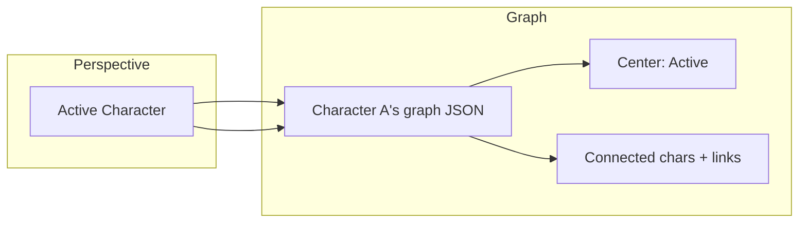
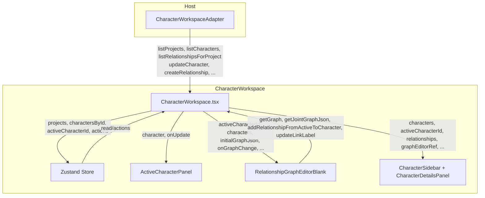
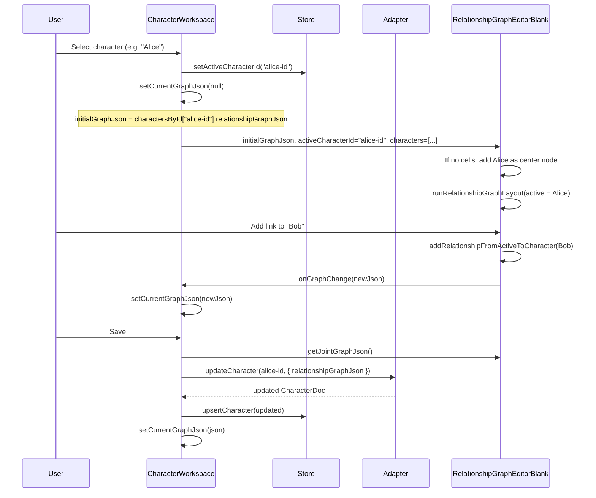
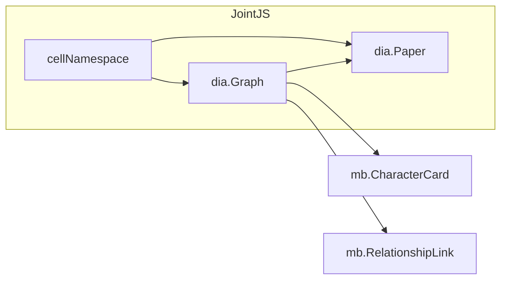

# Character Workspace & Relationship Graph

This document describes the structure and implementation of the **Character Workspace** and the **RelationshipGraphEditorBlank** component: how data flows, how the active character defines the *perspective* of the relationship graph, and how JointJS is used to render and edit it.

---

## Overview

The Character Workspace is a three-column layout for managing characters and their **relationship graph**. The central idea:

- **The active character is the perspective.** The graph shows *that character’s* view of the world: they are at the center; connected characters and relationship edges are *from their point of view*.
- **Each character owns their own graph.** The graph JSON (`relationshipGraphJson`) is stored **per character** on `CharacterDoc`. Switching the active character loads that character’s saved graph (or an empty one).
- **Relationships are first-class data.** A `RelationshipDoc` (source, target, label, description) lives in the backend; the graph editor’s links are the visual representation. Labels/descriptions can be edited and synced to the relationship record.



---

## Folder Structure

```
src/characters/
├── components/
│   └── CharacterWorkspace/
│       ├── CharacterWorkspace.tsx          # Root: 3-column layout, data loading, handlers
│       ├── components/
│       │   ├── ActiveCharacterPanel.tsx    # Left: active character lore/edit (perspective owner)
│       │   ├── CharacterDetailsPanel.tsx   # Right: selected node details
│       │   ├── CharacterSidebar/           # Right: character list, relationships list, search
│       │   │   ├── CharacterList.tsx
│       │   │   ├── RelationshipsList.tsx
│       │   │   └── ...
│       │   ├── RelationshipGraphEditorBlank/   # Center: JointJS graph
│       │   │   ├── RelationshipGraphEditorBlank.tsx
│       │   │   ├── cellNamespace.ts        # Registers mb.CharacterCard, mb.RelationshipLink
│       │   │   ├── facade.ts               # Optional ref-based facade
│       │   │   ├── types.ts
│       │   │   ├── elements/
│       │   │   │   └── characterElement.ts  # mb.CharacterCard definition + factory
│       │   │   ├── links/
│       │   │   │   └── relationshipLink.ts  # mb.RelationshipLink + createRelationshipLink
│       │   │   ├── tools/
│       │   │   │   ├── graphInteractions.ts # Click, hover, selection
│       │   │   │   ├── elementTools.ts     # Element visual state (selected/hover)
│       │   │   │   └── linkTools.ts        # Link visual state
│       │   │   └── utils/
│       │   │       ├── createElement.ts    # createCharacterElement, createBlankPlaceholderElement
│       │   │       ├── createLink.ts        # Re-exports createRelationshipLink
│       │   │       ├── layout.ts            # bringElementsToFront
│       │   │       ├── paperViewport.ts     # Zoom (wheel) + pan (blank drag)
│       │   │       ├── relationshipGraphLayout.ts  # Center active, others in circle
│       │   │       └── syncGraphElementsWithCharacters.ts  # After fromJSON: sync names/avatars
│       │   ├── CharacterWorkspaceHeader.tsx
│       │   ├── CharacterWorkspaceModals.tsx
│       │   └── ...
│       ├── store/
│       │   ├── character-workspace-store.tsx  # Zustand store (project + characters + view state)
│       │   └── slices/
│       │       ├── characters.slice.ts
│       │       ├── project.slice.ts
│       │       └── viewState.slice.ts
│       ├── hooks/
│       │   └── useDebouncedAutosave.ts
│       └── utils/
│           └── jointCharacterUtils.ts
├── types/
│   ├── character.ts    # CharacterDoc, JointGraphJson, RelationshipDoc, etc.
│   └── contracts.ts    # CharacterWorkspaceAdapter
└── index.ts
```

---

## High-Level Architecture



- **Data adapter:** Host implements `CharacterWorkspaceAdapter` (projects, characters, relationships, media). The workspace never imports host types; it uses domain types (`CharacterDoc`, `RelationshipDoc`, etc.).
- **Zustand store:** Holds `projects`, `charactersById`, `activeCharacterId`, and view state (modals, debug drawer). Graph JSON is *not* stored in Zustand for the current session: it lives in `CharacterWorkspace` as `currentGraphJson` (dirty) or comes from `charactersById[activeCharacterId].relationshipGraphJson` when not dirty.
- **RelationshipGraphEditorBlank:** Gets `activeCharacterId`, `characters`, and `initialGraphJson`; exposes a ref for saving JSON, adding relationships from active to another character, and updating link labels.

---

## Data Flow: Active Character as Perspective



- **Selecting a character** sets `activeCharacterId` and clears local dirty graph state so the editor gets that character’s `relationshipGraphJson` (or empty).
- **Graph edits** are reported via `onGraphChange` and kept in `currentGraphJson` until save.
- **Save** reads JSON from the editor ref, calls `dataAdapter.updateCharacter(activeCharacterId, { relationshipGraphJson })`, then updates the store and clears dirty state.
- So the **perspective** is simply: “the graph we’re viewing/editing is the **active character’s** graph.”

---

## Relationship Graph Model (Per-Character)

```mermaid
erDiagram
  CharacterDoc ||--o| JointGraphJson : "relationshipGraphJson"
  JointGraphJson ||--|{ Cell : "cells"
  Cell --> Element : "element"
  Cell --> Link : "link"
  Element --> CharacterDoc : "id = character-{id}"
  Link --> Element : "source"
  Link --> Element : "target"
  RelationshipDoc }o-- Link : "optional match by source/target"

  CharacterDoc {
    string id
    string name
    JointGraphJson relationshipGraphJson
  }
  RelationshipDoc {
    string sourceCharacter
    string targetCharacter
    string label
    string description
  }
```

- **CharacterDoc** has optional `relationshipGraphJson` (JointJS `graph.toJSON()`).
- **Graph:** elements are `mb.CharacterCard` with `id = character-{characterId}`; links are `mb.RelationshipLink` with source/target element IDs.
- **RelationshipDoc** is backend data (project, sourceCharacter, targetCharacter, label, description). The sidebar’s relationship list matches links to relationship records by source/target to show/edit labels and descriptions.

---

## RelationshipGraphEditorBlank in Detail

### Role

- Renders and edits one **JointJS** graph.
- **Active character** = the character whose graph we’re editing; they are the **center** of the layout.
- Elements = characters (card with name, avatar, initials); links = relationships (with optional label).
- Exposes a ref for: `getGraph()`, `getJointGraphJson()`, `addRelationshipFromActiveToCharacter(character)`, `getSelection()`, `clearSelection()`, `updateLinkLabel(linkId, label)`.

### JointJS Usage



- **Graph** is created with a **cell namespace** so that `fromJSON`/`toJSON` know our custom types (`mb.CharacterCard`, `mb.RelationshipLink`).
- **Paper** is the view (DOM); it uses the same namespace for views.
- **Elements** are created with `createCharacterElement(character)` → `createCharacterCardElement('character-' + id, position, attrs)`.
- **Links** are created with `createRelationshipLink(sourceId, targetId, { id?, label? })`.

### Cell Namespace (`cellNamespace.ts`)

JointJS needs a map of type name → constructor for serialization and view creation. We register:

- **Standard shapes** from `@joint/core` (`shapes`).
- **mb.CharacterCard** – our character card element (from `characterElement.ts`).
- **mb.RelationshipLink** – our relationship link (from `relationshipLink.ts`).

So when we `graph.fromJSON(json)`, any cell with `type: 'mb.CharacterCard'` or `type: 'mb.RelationshipLink'` is instantiated correctly.

### Elements (`elements/characterElement.ts`)

- **Definition:** `dia.Element.define('mb.CharacterCard', { ... attrs, size }, { markup, setName, setInitials, setAvatarUrl, setSelected, ... })`.
- **Visual:** Plate, avatar (image or initials), name, optional subtitle; selection/hover styling.
- **Factory:** `createCharacterCardElement(id, position, attrs)` – id for elements is `character-{characterId}` so we can map back to `CharacterDoc`.
- **Sync:** After `graph.fromJSON()`, `syncGraphElementsWithCharacters(graph, characters)` updates each element’s name/avatar/initials from the current `CharacterDoc` list.

### Links (`links/relationshipLink.ts`)

- **Definition:** `dia.Link.define('mb.RelationshipLink', { attrs, router, connector, labels }, { markup, labelMarkup })`.
- **Visual:** Rounded connector, arrow, optional label pill at mid edge.
- **Factory:** `createRelationshipLink(sourceId, targetId, options)` – source/target are element IDs (`character-*`). Label is optional and stored in the link’s labels; can be synced to `RelationshipDoc` via the sidebar.

### Tools

- **graphInteractions.ts:** Listens to Paper/Graph for `cell:mouseenter`, `cell:mouseleave`, `cell:pointerclick`, `blank:pointerdown`, and `remove`. Tracks hover/selection and applies visual state via **elementTools** and **linkTools**. Calls `onSelectionChange` with `{ type: 'element'|'link'|null, id }` so the parent can set `selectedNodeId` / `editingEdgeId`.
- **paperViewport.ts:** Wheel = zoom (scale at pointer), blank drag = pan. No dependency on JointJS tools; just event listeners on the paper container and paper.

### Layout

- **relationshipGraphLayout.ts:** `runRelationshipGraphLayout(graph, paperWidth, paperHeight, activeCharacterId)`:
  - Puts the **active character** element at the center of the paper.
  - Places all other elements in a **circle** around it (fixed radius).
- **layout.ts:** `bringElementsToFront(graph)` so elements draw above links.

### Lifecycle in the Component

1. **Mount:** Create a div for JointJS (not the React root div), create `dia.Graph` with `getCellNamespace()`, create `dia.Paper`, install graph interactions and paper viewport. If `initialGraphJson` has cells, `graph.fromJSON(initialGraphJson)` then `syncGraphElementsWithCharacters(graph, characters)`; else add the active character element (or a placeholder if no active character). Then `bringElementsToFront`, `runRelationshipGraphLayout`.
2. **Resize:** `ResizeObserver` on the wrapper updates paper dimensions.
3. **Unmount:** Destroy viewport and interactions, remove paper, clear refs, remove the JointJS container.

Graph changes (add/remove/move cells, link labels) are not auto-reported; the parent gets JSON when it calls `getJointGraphJson()` on save, or when the ref’s `addRelationshipFromActiveToCharacter` runs (it calls `onGraphChange` after adding the link and re-running layout).

---

## Design Patterns

| Pattern | Where | Purpose |
|--------|--------|--------|
| **Adapter** | `CharacterWorkspaceAdapter` | Host provides data (projects, characters, relationships, media); workspace stays independent of host types. |
| **Single source of truth per character** | `CharacterDoc.relationshipGraphJson` | Each character owns one graph; active character selects which graph we edit. |
| **Dirty graph in parent** | `currentGraphJson` in CharacterWorkspace | Unsaved edits live in React state; initial load comes from store. Save writes back to adapter and store. |
| **Ref-based API** | `RelationshipGraphEditorBlankRef` | Parent calls `getJointGraphJson()`, `addRelationshipFromActiveToCharacter()`, `updateLinkLabel()` without prop drilling. |
| **Cell namespace** | `cellNamespace.ts` | One place that registers custom JointJS types for Graph/Paper so JSON round-trip and views work. |
| **Sync after load** | `syncGraphElementsWithCharacters` | After `fromJSON`, element names/avatars stay in sync with current `CharacterDoc` list. |
| **Center = perspective** | `relationshipGraphLayout` + “active” in UI | Active character is always centered; layout and copy (“Active Character”) reinforce that this is their relationship view. |

---

## Summary

- **Character Workspace** = three columns: active character (left), relationship graph (center), character list + relationships + details (right).
- **Active character** = perspective: their graph is shown and edited; they are the center node; links are “their” relationships to others.
- **Data:** Characters and relationships come from the host via `CharacterWorkspaceAdapter`; graph JSON is stored per character on `relationshipGraphJson` and saved with `updateCharacter`.
- **RelationshipGraphEditorBlank** uses **JointJS** (Graph + Paper, custom `mb.CharacterCard` and `mb.RelationshipLink`, namespace, layout, viewport, and interaction tools) to render and edit that graph with the active character fixed at the center.
