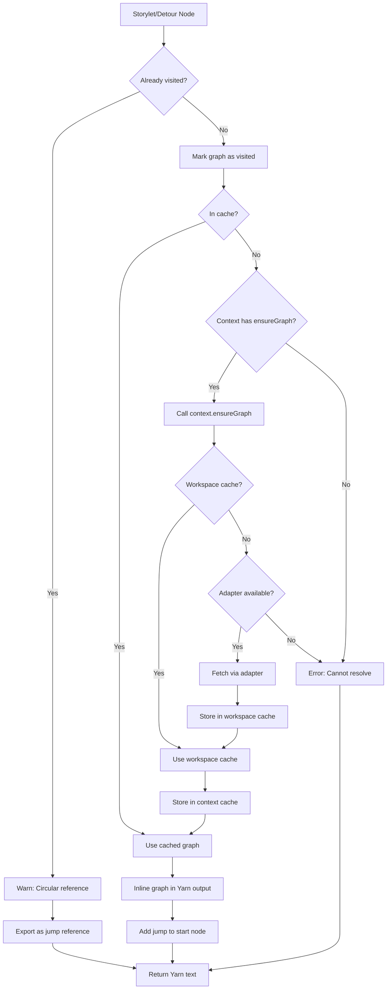

# Context Resolution Flow

```mermaid
flowchart TD
    Start[Storylet/Detour Node] --> CheckVisited{Already visited?}
    CheckVisited -->|Yes| CircularRef[Warn: Circular reference]
    CircularRef --> Fallback[Export as jump reference]
    
    CheckVisited -->|No| MarkVisited[Mark graph as visited]
    MarkVisited --> CheckCache{In cache?}
    
    CheckCache -->|Yes| UseCache[Use cached graph]
    CheckCache -->|No| CheckContext{Context has ensureGraph?}
    
    CheckContext -->|Yes| EnsureGraph[Call context.ensureGraph]
    CheckContext -->|No| Error[Error: Cannot resolve]
    
    EnsureGraph --> WorkspaceCache{Workspace cache?}
    WorkspaceCache -->|Yes| UseWorkspaceCache[Use workspace cache]
    WorkspaceCache -->|No| CheckAdapter{Adapter available?}
    
    CheckAdapter -->|Yes| FetchAdapter[Fetch via adapter]
    CheckAdapter -->|No| Error
    
    FetchAdapter --> StoreWorkspace[Store in workspace cache]
    StoreWorkspace --> UseWorkspaceCache
    UseWorkspaceCache --> StoreContext[Store in context cache]
    StoreContext --> UseCache
    
    UseCache --> InlineGraph[Inline graph in Yarn output]
    InlineGraph --> AddJump[Add jump to start node]
    AddJump --> End[Return Yarn text]
    
    Fallback --> End
    Error --> End
```
