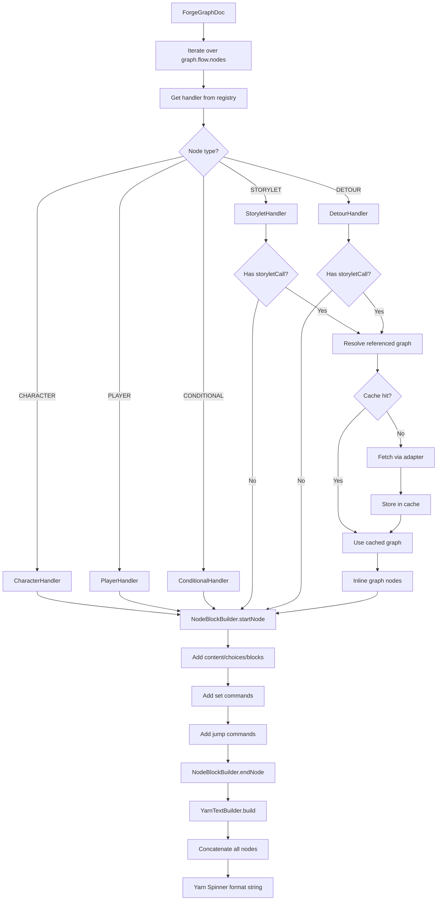

# Export Flow Diagram

```mermaid
flowchart TD
    Start[ForgeGraphDoc] --> Iterate[Iterate over graph.flow.nodes]
    Iterate --> GetHandler[Get handler from registry]
    GetHandler --> CheckType{Node type?}
    
    CheckType -->|CHARACTER| CharacterHandler
    CheckType -->|PLAYER| PlayerHandler
    CheckType -->|CONDITIONAL| ConditionalHandler
    CheckType -->|STORYLET| StoryletHandler
    CheckType -->|DETOUR| DetourHandler
    
    CharacterHandler --> BuildNode[NodeBlockBuilder.startNode]
    PlayerHandler --> BuildNode
    ConditionalHandler --> BuildNode
    StoryletHandler --> CheckStorylet{Has storyletCall?}
    DetourHandler --> CheckDetour{Has storyletCall?}
    
    CheckStorylet -->|Yes| ResolveGraph[Resolve referenced graph]
    CheckStorylet -->|No| BuildNode
    CheckDetour -->|Yes| ResolveGraph
    CheckDetour -->|No| BuildNode
    
    ResolveGraph --> CheckCache{Cache hit?}
    CheckCache -->|Yes| UseCache[Use cached graph]
    CheckCache -->|No| FetchGraph[Fetch via adapter]
    FetchGraph --> StoreCache[Store in cache]
    StoreCache --> UseCache
    UseCache --> InlineGraph[Inline graph nodes]
    InlineGraph --> BuildNode
    
    BuildNode --> AddContent[Add content/choices/blocks]
    AddContent --> AddFlags[Add set commands]
    AddFlags --> AddJumps[Add jump commands]
    AddJumps --> EndNode[NodeBlockBuilder.endNode]
    EndNode --> YarnText[YarnTextBuilder.build]
    YarnText --> Concatenate[Concatenate all nodes]
    Concatenate --> Result[Yarn Spinner format string]
```
