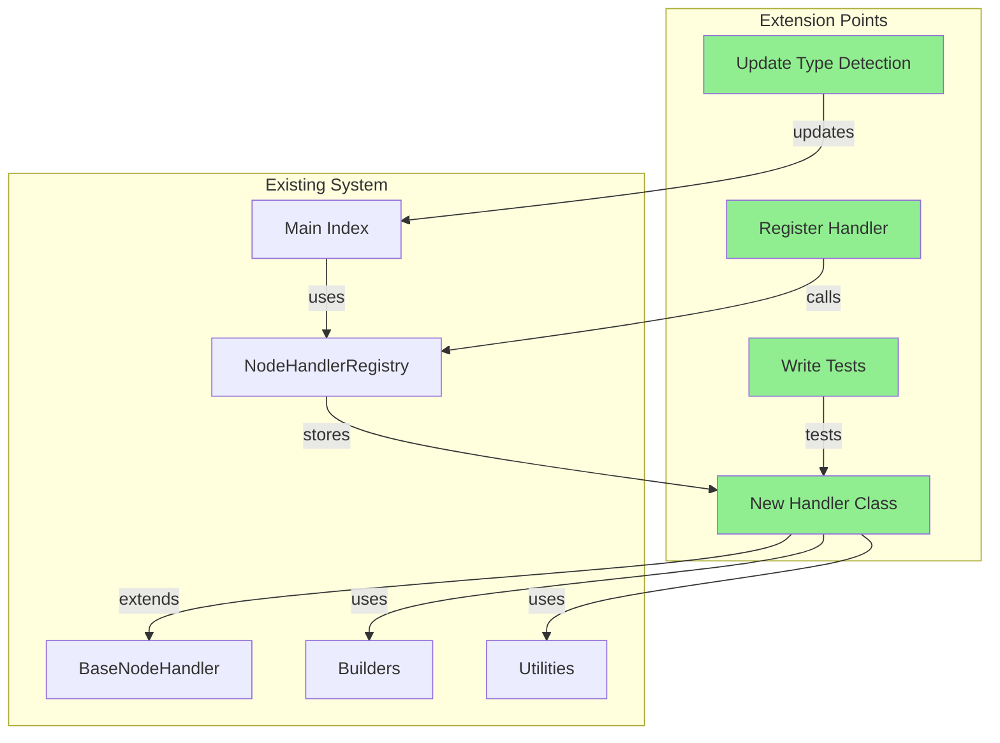

# Extension Points Diagram

```mermaid
graph TB
    subgraph Extension["Extension Points"]
        NewHandler[New Handler Class]
        Register[Register Handler]
        TypeDetection[Update Type Detection]
        Tests[Write Tests]
    end
    
    subgraph Existing["Existing System"]
        Registry[NodeHandlerRegistry]
        Index[Main Index]
        BaseHandler[BaseNodeHandler]
        Builders[Builders]
        Utils[Utilities]
    end
    
    NewHandler -->|extends| BaseHandler
    NewHandler -->|uses| Builders
    NewHandler -->|uses| Utils
    
    Register -->|calls| Registry
    Registry -->|stores| NewHandler
    
    TypeDetection -->|updates| Index
    Index -->|uses| Registry
    
    Tests -->|tests| NewHandler
    
    style NewHandler fill:#90EE90
    style Register fill:#90EE90
    style TypeDetection fill:#90EE90
    style Tests fill:#90EE90
```
