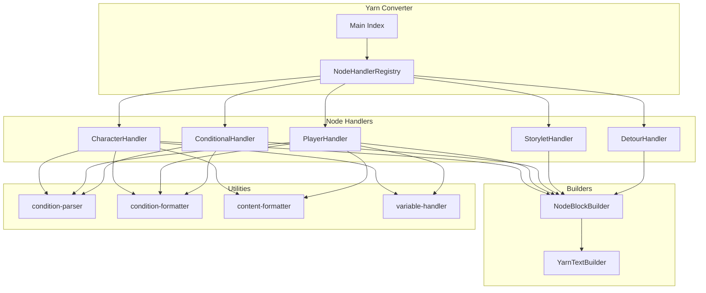

# Handler Architecture Diagram

```mermaid
graph TB
    subgraph Converter["Yarn Converter"]
        Registry[NodeHandlerRegistry]
        Index[Main Index]
    end
    
    subgraph Handlers["Node Handlers"]
        Character[CharacterHandler]
        Player[PlayerHandler]
        Conditional[ConditionalHandler]
        Storylet[StoryletHandler]
        Detour[DetourHandler]
    end
    
    subgraph Builders["Builders"]
        TextBuilder[YarnTextBuilder]
        BlockBuilder[NodeBlockBuilder]
    end
    
    subgraph Utils["Utilities"]
        ConditionParser[condition-parser]
        ConditionFormatter[condition-formatter]
        ContentFormatter[content-formatter]
        VariableHandler[variable-handler]
    end
    
    Index --> Registry
    Registry --> Character
    Registry --> Player
    Registry --> Conditional
    Registry --> Storylet
    Registry --> Detour
    
    Character --> BlockBuilder
    Player --> BlockBuilder
    Conditional --> BlockBuilder
    Storylet --> BlockBuilder
    Detour --> BlockBuilder
    
    BlockBuilder --> TextBuilder
    
    Character --> ConditionParser
    Character --> ConditionFormatter
    Character --> ContentFormatter
    Character --> VariableHandler
    
    Player --> ConditionParser
    Player --> ConditionFormatter
    Player --> ContentFormatter
    Player --> VariableHandler
    
    Conditional --> ConditionParser
    Conditional --> ConditionFormatter
```
